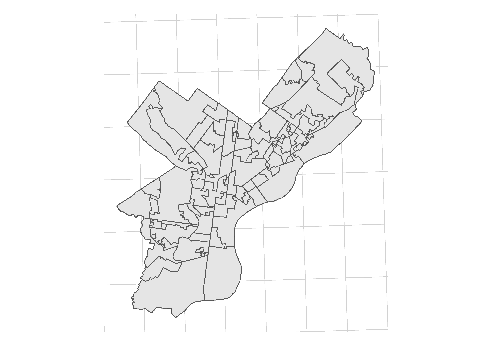
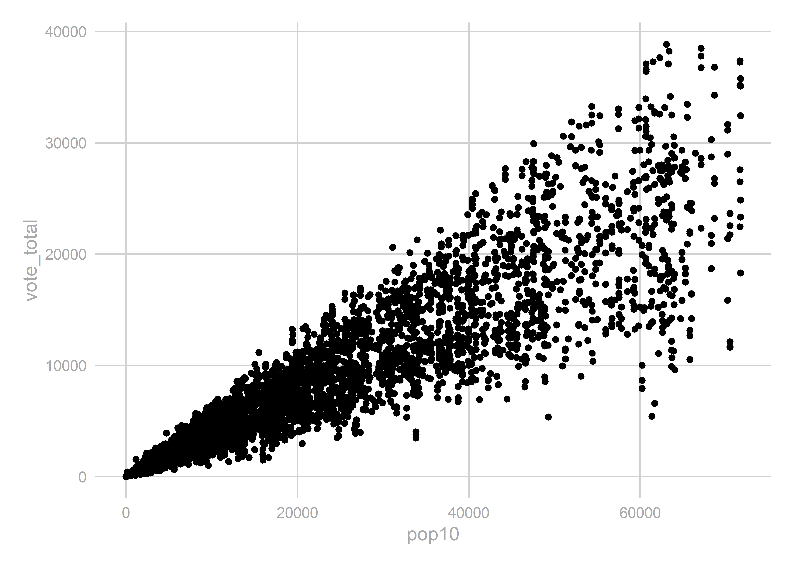

# Predicting the State House, Part 2

## Creating Geographies

First, let's load the  [Relational Database](link).


```r
library(tidyverse)
source("utils/util.R")
load("data/relational_db.rda")
```

The `results` dataframe contains precinct-level results. For our model, we are going to need to compare these results from year to year (for example, to use last election's results to predict this one). **This can be a problem.** Districts can, and do, change from year to year. There are two ways this can happen, one measurable and one not. 

First, the measurable: the state legislature passed new boundaries following the 2010 US Census. Thus, the districts from 2010 and before are completely different from those 2014 and after. The middle year, 2012, was particularly complicated. The Supreme Court had struck down the State House (STH) and State Senate (STS) boundaries, but allowed the US Congress (USC) boundaries; that election used the pre-2012 boundaries for state elections, post-2012 boundaries for USC. And then in 2018, of course, the PA Supreme Court redrew the USC boundaries, but not the state ones.

Here's a table of elections to vintage of districts:

| Election | State Boundaries | USC Boundaries |
|----------|------------------|----------------|
|2010 and before | pre-2012 | pre-2012 |
| 2012 | pre-2012 | post-2012 |
| 2014-2016 | post-2012 | post-2012 |
| 2018 | post-2012 | 2018 |

But that's all measurable. We can (and will) use GIS to create crosswalks from one to the other.

More pernicious is that municipalities seem to arbitrarily change the names and boundaries of their precincts. So precinct 1 in a township in 2004 possibly has zero overlap with that precinct in 2006. Ideally, we would have a shapefile of the precincts and could map them out. But we don't. As far as I can tell, the only requirement for municipalities is to provide pdfs or even textual descriptions of their new precincts (e.g. \"South of Pine Street, down to Maple St.\"). After gallantly downloading a few dozen pdfs, I gave up on attempts to map this out. 

(Aside: There's a [great project](https://github.com/nvelsko/election-geodata) to collect and create shapefiles for all precincts used in the 2016 election, but even that would only be for a single year, and not the full set of precincts we need.)

The table `precincts_to_districts` contains a matching of each precinct and what STH, STS, and USC districts they voted for in a given election. This is pulled entirely from the results table; there's no GIS used.

For example, here are precinct ids that changed State House districts between 2014 and 2016. Since the STH districts didn't change that year, the only explanation is that the precinct boundaries are in totally new places. Four precincts in Delaware County appear to have swapped Congressional and State House districts. This could be an actual change in the map, a data error, who knows.


```r
inner_join(
  precincts_to_districts %>% 
    filter(election == "2014 G"),
  precincts_to_districts %>% 
    filter(election == "2016 G"),
  by=c('county_code_.', 'precinct_code', 'vtd_code')
) %>% 
  filter(sth.x != sth.y) %>% as.data.frame()
```

```
##   election.x county_code_. precinct_code vtd_code cofips.x usc.x sts.x
## 1     2014 G            23          3350     3370      045    01   026
## 2     2014 G            23          3380     3400      045    01   026
## 3     2014 G            23          3470     3490      045    07   026
## 4     2014 G            23          3510     3530      045    07   026
##   sth.x election.y cofips.y usc.y sts.y sth.y
## 1   164     2016 G      045    07   026   163
## 2   164     2016 G      045    07   026   163
## 3   163     2016 G      045    01   026   164
## 4   163     2016 G      045    01   026   164
```

The one thing that I do trust is the county and STH, STS, and USC boundaries. So we'll use those as our anchor. In other words, if precinct code 3350 voted for Congressional District 1 in 2014, and for CD 7 in 2016, we'll assume that the boundaries moved, and not that the same people voted for different districts.

So let's create our own geographies. The idea is that we will identify unique combinations of STH, STS, USC, and county boundaries using shapefiles. We can then confidently map the precinct results to them, because we know which STH, STS, and USC each precinct voted for in a given election. These geographies will thus be larger than precincts, but smaller than STH boundaries (potentially equal to, if an STH is entirely contained withing STS, USC, and county). I call these, imaginatively, `geographies`. 

We will need four vintages of these: pre-2012, 2012, post-2012, and 2018 (see the table above). Let's load the shapefiles, and calculate the intersections of the four geometries:


```r
## Warning, I haphazardly move between sf and sp packages, 
## based on my preferred function.
library(sf)

library(rgeos)
library(rgdal)
library(sp)

sth_pre2012 <- st_read("data/state_house/tigris_lower_house_2011.shp", quiet=TRUE) %>%
  mutate(sth = SLDLST)
sth_post2012 <- st_read("data/state_house/tigris_lower_house_2015.shp", quiet=TRUE) %>%
  mutate(sth = SLDLST)
sts_pre2012 <- st_read("data/state_senate/tigris_upper_house_2011.shp", quiet=TRUE) %>%
  mutate(sts = SLDUST)
sts_post2012 <- st_read("data/state_senate/tigris_upper_house_2015.shp", quiet=TRUE) %>%
  mutate(sts = SLDUST)
usc_pre2012 <- st_read("data/congress/tigris_usc_2011.shp", quiet=TRUE) %>% 
  mutate(usc = CD111FP)
usc_post2012 <- st_read("data/congress/tigris_usc_2015.shp", quiet=TRUE) %>%
  mutate(usc = CD114FP)
usc_2018 <- st_read("data/congress/supcourt_usc_2018.shp", quiet=TRUE) %>% 
  mutate(usc = DISTRICT)
counties <- st_read("data/census/tigris_counties_2015.shp", quiet=TRUE) %>%
  mutate(cofips = COUNTYFP)


## some helper functions
get_sp_id <- function(s) sapply(s@polygons, slot, "ID")

gInt_byid <- function(x, y, sep="_"){
  int <- gIntersection(x, y, byid=TRUE, drop_lower_td=TRUE)
  int <- gBuffer(int, byid=TRUE, width=0)
  int <- spChFIDs(int, gsub("\\s", sep, get_sp_id(int)))
  return(int)
}

sf_to_sp <- function(sf, idcol){
  sf <- as(sf, "Spatial")
  sf <- spChFIDs(sf, as.character(sf@data[,idcol]))
  return(sf)
}


get_intersection <- function(sth, sts, usc, counties, vintage){
  ## I find the sf intersection functions hard to work with, so we'll use sp
  sth <- sf_to_sp(sth, 'sth') 
  sts <- sf_to_sp(sts, 'sts')
  usc <- sf_to_sp(usc, 'usc')
  counties <- sf_to_sp(counties, 'cofips')
  
  sth_sts <- gInt_byid(sth, sts)
  sth_sts_usc <- gInt_byid(sth_sts, usc)
  sth_sts_usc_co <- gInt_byid(sth_sts_usc, counties)
  sth_sts_usc_co <- spChFIDs(
    sth_sts_usc_co, 
    paste0(vintage, "_", row.names(sth_sts_usc_co))
  )
  
  id_df <- data.frame(GEOID = row.names(sth_sts_usc_co)) %>%  
    separate(
      GEOID, 
      into=c('vintage', 'sth', 'sts', 'usc','cofips'), 
      sep="_", 
      remove=FALSE
    )
  
  sth_sts_usc_co <- SpatialPolygonsDataFrame(
    sth_sts_usc_co, 
    id_df,
    match.ID=FALSE
  )

  sth_sts_usc_co <- st_as_sf(sth_sts_usc_co)
  return(sth_sts_usc_co)
}

## get and store the geographies
geographies <- list()
geographies[['pre2012']] <- get_intersection(
  sth_pre2012, sts_pre2012, usc_pre2012, counties, "pre2012"
)
  
geographies[['2012']] <- get_intersection(
  sth_pre2012, sts_pre2012, usc_post2012, counties, "2012"
)

geographies[['post2012']] <- get_intersection(
  sth_post2012, sts_post2012, usc_post2012, counties, "post2012"
)

geographies[['2018']] <- get_intersection(
  sth_post2012, sts_post2012, usc_2018, counties, "2018"
)

## create a single table to rule them all
geographies <- do.call(rbind, geographies)

## one useful table matching years to their vintage
year_to_geo_vintage <- data.frame(
  year = as.character(seq(2002, 2018, 2)),
  vintage = c(rep("pre2012", 5), "2012", rep("post2012", 2), "2018"),
  stringsAsFactors = FALSE
)
```

It's worth noting that `geographies` are weird. They are wildly different sizes, and in general represent vastly different populations. One geography might be an entire state house district (if it's nested within a state senate, congressional, and county boundary). Another might be a tiny sliver with no population, where a nub of one district crosses into a different county. We'll need to keep this in mind when we model them later. 

For example, here are the 2014-2016 geographies for Philadelphia:

```r
ggplot(
  geographies %>% filter(vintage == 'post2012' & cofips == 101)
) + 
  geom_sf() +
  theme_map_sixtysix()
```



To be able to ignore precincts forever hereafter, let's aggregate the results from precincts to geographies.


```r
tmp_result_list <- list()

for(year in seq(2002, 2016, 2)){
  vintage <- year_to_geo_vintage$vintage[year_to_geo_vintage$year == year]
  geo <- geographies[geographies$vintage == vintage,] %>%
    as.data.frame() %>%
    select(-geometry)
  
  tmp_result <- results %>% 
    filter(substr(race, 1, 4) == year) %>%
    left_join(races %>% select(race, election)) %>%
    left_join(precincts_to_districts) %>%
    left_join(geo) %>%
    group_by(race, candidate, party, cofips, usc, sts, sth) %>%
    summarise(vote_total = sum(vote_total)) %>%
    group_by() %>%
    mutate(
      GEOID = paste(vintage, sth, sts, usc, cofips, sep="_")
    )
  
  tmp_result_list[[as.character(year)]] <- tmp_result
}

geography_results <- bind_rows(tmp_result_list)

head(geography_results)
```

```
## # A tibble: 6 x 9
##   race     candidate   party cofips usc   sts   sth   vote_total GEOID    
##   <chr>    <chr>       <chr> <chr>  <chr> <chr> <chr>      <dbl> <chr>    
## 1 2002 G ~ ED RENDELL~ DEM   001    19    033   091         5393 pre2012_~
## 2 2002 G ~ ED RENDELL~ DEM   001    19    033   193         2339 pre2012_~
## 3 2002 G ~ ED RENDELL~ DEM   003    04    037   016          698 pre2012_~
## 4 2002 G ~ ED RENDELL~ DEM   003    04    037   027          876 pre2012_~
## 5 2002 G ~ ED RENDELL~ DEM   003    04    037   044         2024 pre2012_~
## 6 2002 G ~ ED RENDELL~ DEM   003    04    038   024          503 pre2012_~
```

Let's do a quick check to make sure we didn't duplicate any votes:

```r
usp_2016 <- "2016 G USP USP-PA"

new_results <- geography_results %>% 
  filter(race == usp_2016) %>%
  group_by(candidate) %>%
  summarise(new_votes = sum(vote_total)) 

old_results <- results %>% 
  filter(race == usp_2016) %>%
  group_by(candidate) %>%
  summarise(old_votes = sum(vote_total))

left_join(new_results, old_results)
```

```
## # A tibble: 5 x 3
##   candidate              new_votes old_votes
##   <chr>                      <dbl>     <dbl>
## 1 DARRELL L CASTLE (USP)     21566     21566
## 2 DONALD J TRUMP (USP)     2970378   2970378
## 3 GARY E JOHNSON (USP)      146659    146659
## 4 HILLARY CLINTON (USP)    2925758   2925758
## 5 JILL STEIN (USP)           49935     49935
```
Yep, Donald Trump still won.

## Year to year crosswalks

We're going to want to compare the results from one year to the next, so we need to map vintages of the geographies to each other. In order to do that, let's build a crosswalk. People often use areal crosswalks, but we'll do one better with population-weighted crosswalks. 

The strategy is to create the geographic intersections of geographies `x` and `y`, use Census Blocks to calculate the population in each intersection, and then apportion votes in `x` based on the fraction of its population that overlaps with `y`. We'll use blocks  from the 2010 Census. Using populations from a single year won't accurately weight places where population are changing, but will provide a darn good first order approximation. (You could imagine being even better, weighting by voting age population, or even downloading the voter file and weighting by voters).


```r
block_pops <- read_csv(
  "data/census/block10_centroid_pops.csv", 
  col_types = cols(GEOID10 = col_character())
) 

## get rid of NA pop blocks. (I have no idea what these are, but they have 0 ALAND)
block_pops %>% filter(is.na(pop10))
```

```
## # A tibble: 7 x 9
##   STATEFP10 COUNTYFP10 TRACTCE10 BLOCKCE10 GEOID10 pop10 ALAND10 INTPTLAT10
##       <int> <chr>      <chr>         <int> <chr>   <int>   <int>      <dbl>
## 1        42 049        990000            2 420499~    NA       0       42.2
## 2        42 049        990000            6 420499~    NA       0       42.2
## 3        42 049        990000            1 420499~    NA       0       42.3
## 4        42 049        990000            3 420499~    NA       0       42.2
## 5        42 049        990000            4 420499~    NA       0       42.1
## 6        42 049        012400            1 420490~    NA       0       42.1
## 7        42 049        990000            5 420499~    NA       0       42.2
## # ... with 1 more variable: INTPTLON10 <dbl>
```

```r
block_pops <- block_pops %>% filter(!is.na(pop10))

block_cents <- SpatialPointsDataFrame(
  coords=block_pops[,c('INTPTLON10','INTPTLAT10')],
  data=block_pops,
  coords.nrs=match(c('INTPTLON10','INTPTLAT10'), names(block_pops)),
  proj4string=CRS("+init=epsg:4326") 
) %>% 
  st_as_sf %>%
  st_transform(st_crs(geographies))
  
create_crosswalk <- function(
  x, 
  y, 
  blocks=block_cents, 
  xid='GEOID', 
  yid='GEOID'
){
  x <- sf_to_sp(x, xid) 
  y <- sf_to_sp(y, yid)

  id_sep <- ":"
  int <- gInt_byid(x, y, id_sep)
  blocks_to_int <- blocks %>% as("Spatial") %>% over(int)
  
  # Provide a sanity check that all blocks got mapped.
  print(paste("We lost", sum(is.na(blocks_to_int)), "blocks."))
  print(paste("We lost", sum(blocks$pop10[is.na(blocks_to_int)]), "people."))
  
  crosswalk <- data.frame(
    int_num = blocks_to_int,
    pop = blocks$pop10
  ) %>% 
    mutate(int_id = get_sp_id(int)[int_num]) %>%
    group_by(int_id) %>%
    summarise(pop = sum(pop)) %>%
    group_by() %>%
    separate(int_id, into=c("xid", "yid"), sep=id_sep) %>%
    group_by(xid) %>%
    mutate(frac_of_x = pop / sum(pop)) %>%
    group_by(yid) %>%
    mutate(frac_of_y = pop / sum(pop))
  
  ## check that nothing got duplicated/lost.
  print(paste("Pop of blocks:", sum(blocks$pop10)))
  print(paste("Pop of cw:    ", with(crosswalk, sum(crosswalk$pop))))
  
  return(crosswalk)
}

crosswalks <- list()

for(
  vintage_pair in c(
    "pre2012,2012", "pre2012,post2012", "2012,post2012", "post2012,2018"
  )
){
  print(vintage_pair)
  vintages <- strsplit(vintage_pair, ",")[[1]]
  crosswalks[[vintage_pair]] <- create_crosswalk(
    geographies %>% filter(vintage == vintages[1]), 
    geographies %>% filter(vintage == vintages[2])
  )
}
```

```
## [1] "pre2012,2012"
## [1] "We lost 2 blocks."
## [1] "We lost 0 people."
## [1] "Pop of blocks: 12702379"
## [1] "Pop of cw:     12702379"
## [1] "pre2012,post2012"
## [1] "We lost 2 blocks."
## [1] "We lost 0 people."
## [1] "Pop of blocks: 12702379"
## [1] "Pop of cw:     12702379"
## [1] "2012,post2012"
## [1] "We lost 0 blocks."
## [1] "We lost 0 people."
## [1] "Pop of blocks: 12702379"
## [1] "Pop of cw:     12702379"
## [1] "post2012,2018"
## [1] "We lost 0 blocks."
## [1] "We lost 0 people."
## [1] "Pop of blocks: 12702379"
## [1] "Pop of cw:     12702379"
```

Here's an example of how to use the crosswalk. Suppose we wanted to map the results in 2012 to the geographies in 2014. We want to assign to the 2014 boundaries the weighted average of the results from 2012:

```r
geography_results %>% 
  inner_join(
    races %>% filter(election == '2012 G')
  ) %>%
  left_join(
    crosswalks[["2012,post2012"]], 
    by = c("GEOID" = "xid")
  ) %>%
  group_by(election, yid, office, party) %>%
  summarise(
    vote_total = sum(vote_total * frac_of_x)
  )
```

```
## # A tibble: 7,185 x 5
## # Groups:   election, yid, office [?]
##    election yid                     office party vote_total
##    <chr>    <chr>                   <chr>  <chr>      <dbl>
##  1 2012 G   post2012_001_049_03_049 STH    DEM       15907.
##  2 2012 G   post2012_001_049_03_049 STH    OTH           0 
##  3 2012 G   post2012_001_049_03_049 STS    DEM       13708.
##  4 2012 G   post2012_001_049_03_049 STS    OTH           0 
##  5 2012 G   post2012_001_049_03_049 STS    REP        4480.
##  6 2012 G   post2012_001_049_03_049 USC    DEM       12831.
##  7 2012 G   post2012_001_049_03_049 USC    IND         909.
##  8 2012 G   post2012_001_049_03_049 USC    OTH           0 
##  9 2012 G   post2012_001_049_03_049 USC    REP        4371.
## 10 2012 G   post2012_001_049_03_049 USP    DEM       14046.
## # ... with 7,175 more rows
```

Finally, let's use the crosswalks to add a quick feature to `geographies`: the 2010 population. (This doesn't actually require the crosswalks--we could just map the blocks to a single time period--but since we already have them...)


```r
get_pop_from_cw <- function(vintage_pair, vintage){
  vintage_split <- str_split(vintage_pair, ",")[[1]]
  x_or_y <- c("xid", "yid")[which(vintage_split == vintage)]
  if(length(x_or_y) != 1) stop("vintage doesn't match")
  
  cw <- crosswalks[[vintage_pair]]
  cw$GEOID <- cw[,x_or_y] %>% unlist
  return(cw %>% group_by(GEOID) %>% summarise(pop10 = sum(pop, na.rm = TRUE)))
}

pops_pre2012 <- get_pop_from_cw("pre2012,2012", "pre2012")
pops_2012 <- get_pop_from_cw("pre2012,2012", "2012")
pops_post2012 <- get_pop_from_cw("2012,post2012", "post2012")
pops_2018 <- get_pop_from_cw("post2012,2018", "2018")

geography_pops <- bind_rows(pops_pre2012, pops_2012, pops_post2012, pops_2018)

geographies <- left_join(geographies, geography_pops)
```

Let's compare the total votes to the total population to make sure nothing crazy happened:

```r
uspgov_votes <- geography_results %>%
  inner_join(
    races %>% 
      filter(
        office %in% c("GOV", "USP") &
          substr(election, 6, 6) == "G"
        )
    ) %>%
  mutate(year = substr(election, 1, 4)) %>%
  group_by(year, GEOID) %>%
  summarise(vote_total = sum(vote_total))

ggplot(
  uspgov_votes %>% left_join(geography_pops),
  aes(x=pop10, y=vote_total)
) + 
  geom_point() +
  theme_sixtysix()
```



That looks good, but I want to flag something that's weird. There are some combinations of districts that the shapefiles say shouldn't exist. Here are some votes that aren't in our intersections.

```r
## Looks
uspgov_votes %>% filter(!GEOID %in% geography_pops$GEOID)
```

```
## # A tibble: 40 x 3
## # Groups:   year [8]
##    year  GEOID                  vote_total
##    <chr> <chr>                       <dbl>
##  1 2002  pre2012_046_017_07_091        430
##  2 2002  pre2012_058_045_12_129       1754
##  3 2002  pre2012_058_045_18_129        106
##  4 2002  pre2012_136_016_15_095       1368
##  5 2002  pre2012_137_016_15_095       1672
##  6 2002  pre2012_175_001_03_101          0
##  7 2004  pre2012_058_045_12_129       2770
##  8 2004  pre2012_058_045_18_129        155
##  9 2004  pre2012_136_016_15_095       2223
## 10 2004  pre2012_137_016_15_095       2889
## # ... with 30 more rows
```
Particularly, let's consider `pre2012_136_016_15_095`. There are 1,618 votes in 2006 in precincts voted for State House 137 and State Senate 16. According to the census maps, those districts don't overlap. I haven't been able to figure out if this is a problem with the vote data or the shapefiles, and we'll ignore it for the time being. How many votes do we mess up?  


```r
uspgov_votes %>% 
  filter(!GEOID %in% geography_pops$GEOID) %>%
  group_by(year) %>%
  summarise(sum(vote_total))
```

```
## # A tibble: 8 x 2
##   year  `sum(vote_total)`
##   <chr>             <dbl>
## 1 2002               5330
## 2 2004               8037
## 3 2006               6796
## 4 2008               9332
## 5 2010               6056
## 6 2012              13250
## 7 2014                  1
## 8 2016                  1
```
Our lost votes come entirely in 2012 or before, with a max of 13,000 votes in 2012. Does this matter? I have no idea.

We're done for now. Let's save it and do some analysis! 


```r
if(!dir.exists("outputs")) dir.create("outputs")

save_objs <- c("crosswalks","geographies","geography_results", "year_to_geo_vintage")

save(
  list = save_objs,
  file="outputs/geographies_output.rda"
)
```
