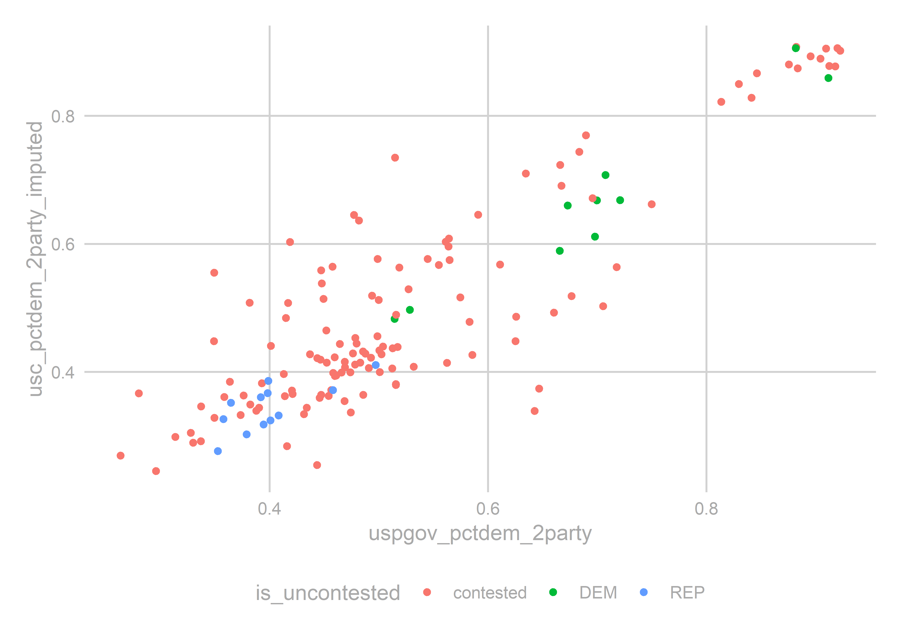

# Predicting the State House, Part 3

## Prepping the data for analysis
After having made such a big deal about Relational Databases, we need to create a boring old rectangular data.frame for our regression analysis. Let's do that here.

Our target is a wide results table, with one row for each race, and sufficient columns for any race-level covariates we want to include in the model.


```r
library(tidyverse)
source("utils/util.R")

load("data/relational_db.rda")
load("outputs/geographies_output.rda")
```

## Thinking ahead
Let's think about how we want to model the data. That'll inform what columns we need. 

First, I decide to model only the "two-party" vote, dropping everyone who's not a Democrat or Republican. Remember that `candidates` has an imputed `party_replaced` for candidates who sneakily ran as third-parties for an uncontested election.


```r
results_with_parties <- geography_results %>%
  inner_join(
    races %>% filter(substr(election, 6, 6) == "G")
  ) %>%
  left_join(candidates_to_races) %>%
  select(race, candidate, office, cofips:sth, vote_total, GEOID, party_replaced) 

## Make sure only Dem or Rep won. If a third party ever won, we'd need to rethink this...
results_with_parties %>%
  group_by(race, office, party_replaced) %>%
  summarise(vote_total = sum(vote_total)) %>%
  group_by(race) %>%
  mutate(rank = rank(-vote_total)) %>%
  filter(rank <= 2) %>%
  group_by(office, party_replaced, rank) %>%
  count() %>%
  spread(rank, n)
```

```
## # A tibble: 39 x 4
## # Groups:   office, party_replaced [39]
##    office party_replaced   `1`   `2`
##    <chr>  <chr>          <int> <int>
##  1 GOV    DEM                3     1
##  2 GOV    REP                1     3
##  3 STH    ACT               NA     1
##  4 STH    CON               NA     1
##  5 STH    CST               NA     3
##  6 STH    D/G               NA     1
##  7 STH    DBP               NA     1
##  8 STH    DEM              742   504
##  9 STH    F4B               NA     1
## 10 STH    F89               NA     1
## # ... with 29 more rows
```

Ok, we've got cleaned parties. 

## The model
Here, I'll preview the model I use in [Making the Predictions](04_model.html), since that dictates what data we need. How will we predict the votes? Here's the model.

Let's call $sth_{yr}$ the two-party percent of the vote for State House in year $y$ in race $r$.

In a best case scenario, we would have polls of voters. Then we could capture simple-seeming things that our data has no idea of: How charismatic is a candidate? Are they well organized? Have they been running ads? Polls are what FiveThirtyEight uses, and why they get such good predictions. Of course, noboday actually publicly polls the 203 PA State House races.

In a worst case scenario, we would have to use only data from prior elections. This would leave us completely unable to predict large swings in public sentiment, and we would have to expand our uncertainty to capture the full range of election-level random effects (aka the way that all races are correlated from year to year). Imagine trying to predict the 2018 election using only the 2016 and 2014 results, without any data from 2018 that signaled Something Is Different. We would need to produce predictions capable of saying both "maybe this year is like 2010" and "maybe this year is like 2006".

Luckily, we are somewhere in between. While we don't have polling on this year's State House races, we do have polling on the US Congressional races. To the extent that USC races are correlated with STH races (probably a lot), we can use the USC polls to estimate the overall tenor of the race. Better yet, we don't have to actually use polling data itself, because FiveThirtyEight has already translated them into predicted votes. \_sunglassesemoji\_ 
Here's the plan: model the results in a State House race as a function of past results in that district along with the US Congress results *in that year*:

$$
\begin{align*}
sth_{yr} =& \beta_0 + \beta_1 sth_{y-1,r} + \beta_2 incumbent\_is\_dem_{yr} + \beta_3 sth_{y-1,r} * incumbent\_is\_dem_{yr} \\
&+ \beta_4 usc_{y,usc(r)} + \beta_5 usc_{y,PA} +  \beta_6 uspgov_{y-1, r} + \beta_7 uspgov_{y, PA} + \beta_8 uspgov_{y-1, PA} + \epsilon_{yr}
\end{align*}
$$
where $incumbent\_is\_dem$ is $1$ if the democratic candidate is an incumbent, $-1$ if the republican is, and $0$ otherwise; $usc(r)$ is the result in the entire USC district that race $r$ belongs to (as opposed to just in the precinct); the subscript $PA$ represents the state-wide results; and $uspgov$ is the result of either the USP or the GOV race, whichever occurred that year. 

One thing to note is that I don't include year-level random effects. Instead, I parametrize the vote using several annual-level covariates: this year's USPGOV results, last year's USPGOV results, this year's total USC results, and an overall mean. That's four degrees of freedom used up when we're only going to be able to use data from seven elections; we're already on thin ice, and hopefully uncertainty in those $\beta$s capture annual variations. We'll check when we model

The above results will work well for races where everything was contested, but we clearly shouldn't include uncontested races. So we'll do two things: for races that are uncontested in year $y$, we will not model them at all, since we know the running candidate will win 100% of the vote. For races that were not contested last cycle but are contested this year, we will model them entirely separately, using a different equation:

**Model for formerly uncontested races:**
$$
\begin{align*}
sth_{yr} =& \beta_0 + \beta_1 dem\_is\_uncontested_{y-1, r} + \beta_2 dem\_is\_uncontested_{y-1, r} * incumbent\_is\_running_{y,r} \\
&+ \beta_4 usc_{y,usc(r)} + \beta_5 usc_{y,PA} +  \beta_6 uspgov_{y-1, r} + \beta_7 uspgov_{y, PA} + \beta_8 uspgov_{y-1, PA} + \epsilon_{yr}
\end{align*}
$$

So now we know what we need: a dataframe with one row per State House race, with the last year's STH results, and this year's USP/GOV and USC results.

First, let's create the wide table, with the STH results.

```r
## from here on out we only consider 2-party vote:
results_with_parties <- results_with_parties %>%
  filter(party_replaced %in% c("DEM", "REP")) 

rep_na_0 <- function(x) replace(x, is.na(x), 0)  
sth_races <- results_with_parties %>%
  inner_join(races %>% filter(office == 'STH'))  %>% 
  group_by(race, sth, party_replaced, candidate) %>%
  summarise(votes_sth = sum(vote_total)) %>%
  left_join(candidates_to_races %>% select(race, candidate, is_incumbent)) %>%
  gather("key", "value", votes_sth, candidate, is_incumbent) %>%
  unite("key", party_replaced, key) %>%
  spread(key, value, convert = TRUE) %>%
  mutate(
    sth_pctdem = rep_na_0(DEM_votes_sth) / (rep_na_0(DEM_votes_sth) + rep_na_0(REP_votes_sth))
  )

sth_races$incumbent_is_dem <- 0
sth_races$incumbent_is_dem <- with(
  sth_races, 
  replace(incumbent_is_dem, !is.na(DEM_is_incumbent) & as.logical(DEM_is_incumbent), 1)
)

sth_races$incumbent_is_dem <- with(
  sth_races, 
  replace(incumbent_is_dem, !is.na(REP_is_incumbent) & as.logical(REP_is_incumbent), -1)
)

sth_races$dem_is_uncontested <- with(
  sth_races,
  ifelse(is.na(REP_candidate), 1, ifelse(is.na(DEM_candidate), -1, 0))
)

## We'll call our main table df
df <- sth_races %>% mutate(year = substr(race,1,4))
head(df)
```

```
## # A tibble: 6 x 12
## # Groups:   race, sth [6]
##   race  sth   DEM_candidate DEM_is_incumbent DEM_votes_sth REP_candidate
##   <chr> <chr> <chr>         <lgl>                    <int> <chr>        
## 1 2002~ 001   LINDA BEBKOJ~ NA                        8895 BILL STEPHAN~
## 2 2002~ 010   <NA>          NA                          NA FRANK LAGROT~
## 3 2002~ 100   BRUCE BEARDS~ NA                        3308 GIBSON C ARM~
## 4 2002~ 101   NOEL HUBLER ~ NA                        5358 MAUREE A GIN~
## 5 2002~ 102   DAN BACKENST~ NA                        3965 PETER J ZUG ~
## 6 2002~ 103   RON BUXTON (~ NA                        7866 SHERMAN C CU~
## # ... with 6 more variables: REP_is_incumbent <lgl>, REP_votes_sth <dbl>,
## #   sth_pctdem <dbl>, incumbent_is_dem <dbl>, dem_is_uncontested <dbl>,
## #   year <chr>
```

Next, let's get the USC results from the same year. We want to calculate the overall USC results, then apportion them to STH districts. While we could use precinct-level USC results to train the model, we don't have precinct-level predictions from FiveThirtyEight, and will need to use only topline results for our predictions. So we'll mimic that here.

```r
usc_results <- results_with_parties %>%
  inner_join(races %>% filter(office == 'USC')) %>%
  group_by(race, usc, party_replaced, candidate) %>%
  summarise(votes_usc = sum(vote_total)) %>%
  group_by(race) %>%
  mutate(
    cand_pct = votes_usc / sum(votes_usc)
  ) 
```

Some of the USC races were uncontested, which will unhelpfully show up as 100% wins, and potentially skew our predictions. Let's simplistically impute what those races would have been had they been contested, by regressing on the district's vote in the USP/GOV race. (Typical studies find that the uncontested candidate would have won by 60%-95%.) 


```r
usc_wide <- usc_results %>% 
  select(race, usc, party_replaced, cand_pct) %>%
  spread(party_replaced, cand_pct, fill=0) %>%
  mutate(
    is_uncontested = ifelse(
      DEM == 0, "REP", ifelse(REP == 0, "DEM", "contested")
    ),
    year = substr(race,1,4),
    usc_pctdem_2party = DEM / (DEM + REP),
    total_votes = DEM + REP
  )

uspgov_by_usc <- results_with_parties %>%
  filter(office %in% c("GOV", "USP")) %>%
  mutate(year = substr(race, 1, 4)) %>%
  group_by(year, usc, party_replaced) %>%
  summarise(vote_total = sum(vote_total)) %>%
  spread(party_replaced, vote_total) %>%
  mutate(uspgov_pctdem_2party = DEM / (DEM + REP)) %>%
  select(-DEM, -REP)

imputation_df <- usc_wide %>% left_join(uspgov_by_usc)
imputation_fit <- lm(
  usc_pctdem_2party ~ uspgov_pctdem_2party + factor(year),
  data=imputation_df %>% filter(is_uncontested == 'contested')
)

summary(imputation_fit)
```

```
## 
## Call:
## lm(formula = usc_pctdem_2party ~ uspgov_pctdem_2party + factor(year), 
##     data = imputation_df %>% filter(is_uncontested == "contested"))
## 
## Residuals:
##       Min        1Q    Median        3Q       Max 
## -0.226962 -0.049530 -0.007464  0.042506  0.296493 
## 
## Coefficients:
##                      Estimate Std. Error t value Pr(>|t|)    
## (Intercept)          -0.07601    0.03669  -2.072  0.04046 *  
## uspgov_pctdem_2party  0.99908    0.04848  20.608  < 2e-16 ***
## factor(year)2004      0.04495    0.03214   1.399  0.16454    
## factor(year)2006      0.02414    0.03003   0.804  0.42321    
## factor(year)2008      0.07660    0.02978   2.572  0.01135 *  
## factor(year)2010      0.10078    0.03064   3.289  0.00132 ** 
## factor(year)2012      0.05891    0.02988   1.972  0.05097 .  
## factor(year)2014     -0.00992    0.03096  -0.320  0.74921    
## factor(year)2016      0.06344    0.03128   2.028  0.04479 *  
## ---
## Signif. codes:  0 '***' 0.001 '**' 0.01 '*' 0.05 '.' 0.1 ' ' 1
## 
## Residual standard error: 0.0815 on 118 degrees of freedom
## Multiple R-squared:  0.7886,	Adjusted R-squared:  0.7743 
## F-statistic: 55.02 on 8 and 118 DF,  p-value: < 2.2e-16
```

Let's make sure they look sane:


```r
imputation_df$usc_pctdem_2party_imputed <- ifelse(
  imputation_df$is_uncontested == 'contested',
  imputation_df$usc_pctdem_2party,
  predict(imputation_fit, newdata = imputation_df)
)

ggplot(imputation_df, aes(x=uspgov_pctdem_2party, y=usc_pctdem_2party_imputed)) +
  geom_point(aes(color=is_uncontested)) +
  theme_sixtysix()
```


Sure, they're fine. The imputed values aren't obviously different than the contested races. Let's apportion the USC results to STH districts using a population-weighted average.


```r
usc_to_sth <- geographies %>% 
  as.data.frame() %>%
  group_by(vintage, sth, usc) %>%
  summarise(
    pop10=sum(pop10, na.rm=TRUE)
  ) %>%
  group_by(vintage, usc) %>%
  mutate(frac_of_usc = pop10 / sum(pop10))

sth_usc_results <- imputation_df %>%
  left_join(year_to_geo_vintage) %>%
  left_join(usc_to_sth) %>%
  group_by(year, sth) %>%
  summarise(
    usc_pctdem = weighted.mean(usc_pctdem_2party_imputed, w = total_votes * frac_of_usc)
  )
```

Join the USC results to the STH results.

```r
df <- left_join(df, sth_usc_results)
tail(df)   
```

```
## # A tibble: 6 x 13
## # Groups:   race, sth [6]
##   race  sth   DEM_candidate DEM_is_incumbent DEM_votes_sth REP_candidate
##   <chr> <chr> <chr>         <lgl>                    <int> <chr>        
## 1 2016~ 094   <NA>          NA                          NA STANLEY E SA~
## 2 2016~ 095   CAROL HILLEV~ FALSE                    13726 JOEL L SEARS~
## 3 2016~ 096   PETER MICHAE~ TRUE                     17340 ROBERT F BIG~
## 4 2016~ 097   CHARLES J KL~ FALSE                    13403 STEVEN CURTI~
## 5 2016~ 098   <NA>          NA                          NA DAVID S HICK~
## 6 2016~ 099   DUANE A GROF~ FALSE                     6219 DAVID H ZIMM~
## # ... with 7 more variables: REP_is_incumbent <lgl>, REP_votes_sth <dbl>,
## #   sth_pctdem <dbl>, incumbent_is_dem <dbl>, dem_is_uncontested <dbl>,
## #   year <chr>, usc_pctdem <dbl>
```

Now let's add the state-wide USP/GOV and USC races:


```r
statewide_results <- results_with_parties %>% 
  inner_join(
    races %>% 
      filter(office %in% c("USP","GOV", "USC")) %>%
      inner_join(elections %>% filter(election_type == "G"))
  ) %>% 
  mutate(office = ifelse(office %in% c("USP", "GOV"), "USPGOV", office)) %>%
  group_by(election_year, party_replaced, office) %>%
  summarise(vote_total=sum(vote_total)) %>%
  unite("key", office, party_replaced) %>%
  spread(key, vote_total) %>%
  mutate(
    uspgov_pctdem_statewide = USPGOV_DEM / (USPGOV_DEM + USPGOV_REP),
    usc_pctdem_statewide = USC_DEM / (USC_DEM + USC_REP)
  )

df <- df %>% left_join(
  statewide_results %>% select(election_year, uspgov_pctdem_statewide, usc_pctdem_statewide), 
  by=c("year"="election_year")
)

head(df)
```

```
## # A tibble: 6 x 15
## # Groups:   race, sth [6]
##   race  sth   DEM_candidate DEM_is_incumbent DEM_votes_sth REP_candidate
##   <chr> <chr> <chr>         <lgl>                    <int> <chr>        
## 1 2002~ 001   LINDA BEBKOJ~ NA                        8895 BILL STEPHAN~
## 2 2002~ 010   <NA>          NA                          NA FRANK LAGROT~
## 3 2002~ 100   BRUCE BEARDS~ NA                        3308 GIBSON C ARM~
## 4 2002~ 101   NOEL HUBLER ~ NA                        5358 MAUREE A GIN~
## 5 2002~ 102   DAN BACKENST~ NA                        3965 PETER J ZUG ~
## 6 2002~ 103   RON BUXTON (~ NA                        7866 SHERMAN C CU~
## # ... with 9 more variables: REP_is_incumbent <lgl>, REP_votes_sth <dbl>,
## #   sth_pctdem <dbl>, incumbent_is_dem <dbl>, dem_is_uncontested <dbl>,
## #   year <chr>, usc_pctdem <dbl>, uspgov_pctdem_statewide <dbl>,
## #   usc_pctdem_statewide <dbl>
```

Now for the hard part: adding lagged STH results. We need to crosswalk the past election results forward to the next year, using the [crosswalks we made](02_geographies.html).


```r
## first, get the results for each year
sth_uspgov_results <- results_with_parties %>%
  mutate(
    office = replace(office, office %in% c("GOV", "USP"), "USPGOV"),
    year = substr(race, 1, 4)
  ) %>%
  filter(office %in% c("STH", "USPGOV")) %>%
  select(year, office, cofips:sth, GEOID, party_replaced, vote_total) %>%
  unite("key", office, party_replaced) %>%
  spread(key, vote_total, fill=0) %>%
  mutate(
    sth_is_uncontested = ifelse(STH_DEM == 0, "REP", ifelse(STH_REP == 0, 'DEM', 'contested')),
    sth_pctdem = STH_DEM / (STH_DEM + STH_REP),
    uspgov_pctdem = USPGOV_DEM / (USPGOV_DEM + USPGOV_REP)
  )

## now, walk them forward.
results_list <- list()
for(year_ in seq(2002, 2016, 2)){
  print(year_)
  vintage <- year_to_geo_vintage$vintage[year_to_geo_vintage$year == year_]
  needed_vintage <- year_to_geo_vintage$vintage[year_to_geo_vintage$year == (year_+2)]
  
  if(vintage != needed_vintage){
    needed_crosswalk <- paste(vintage, needed_vintage, sep=',')
    cw <- crosswalks[[needed_crosswalk]] %>% filter(pop > 0 & !is.na(pop))
  } else {
    ## dummmy cw
    cw <- data.frame(
      xid = unique(sth_uspgov_results$GEOID),
      yid = unique(sth_uspgov_results$GEOID),
      frac_of_x=1,
      frac_of_y=1
    )
  }
  
  geo_results_lagged <- sth_uspgov_results %>%
    filter(year == year_) %>%
    left_join(cw, by = c("GEOID" = "xid")) %>%
    group_by(yid, year) %>%
    summarise(
      sth_pctdem_lagged = weighted.mean(sth_pctdem, w = frac_of_y, na.rm=TRUE),
      uspgov_pctdem_lagged = weighted.mean(uspgov_pctdem, w = frac_of_y, na.rm=TRUE),
      sth_frac_contested_lagged = weighted.mean(sth_is_uncontested == "contested", w = frac_of_y, na.rm=TRUE)
    ) %>%
    mutate(year = as.character(asnum(year) + 2)) %>%
    rename(GEOID = yid)
  
  sth_results_lagged <- geo_results_lagged %>%
    left_join(year_to_geo_vintage) %>%
    left_join(geographies %>% as.data.frame %>% select(-geometry)) %>%
    group_by(year, sth) %>%
    summarise(
      sth_pctdem_lagged = weighted.mean(sth_pctdem_lagged, w=pop10, na.rm=TRUE),
      uspgov_pctdem_lagged = weighted.mean(uspgov_pctdem_lagged, w=pop10, na.rm=TRUE),
      sth_frac_contested_lagged = weighted.mean(sth_frac_contested_lagged, w=pop10, na.rm=TRUE)
    )
  
  results_list[[as.character(year_)]] <- sth_results_lagged
}
```

```
## [1] 2002
## [1] 2004
## [1] 2006
## [1] 2008
## [1] 2010
## [1] 2012
## [1] 2014
## [1] 2016
```

```r
sth_lagged <- do.call(rbind, results_list)

df <- df %>% left_join(sth_lagged)
```

Finally, we need the state-wide USPGOV results from the last year.

```r
statewide_lagged <- statewide_results %>%
  group_by() %>%
  mutate(year = as.character(asnum(election_year)+2)) %>%
  rename(
    uspgov_pctdem_statewide_lagged = uspgov_pctdem_statewide,
    usc_pctdem_statewide_lagged = usc_pctdem_statewide
  ) %>%
  select(year, uspgov_pctdem_statewide_lagged, usc_pctdem_statewide_lagged)

df <- left_join(df, statewide_lagged)
```

We're done with our training data! We have a rectangular data.frame with sufficient data for the equation above. Save it and move on.


```r
save(df, file="outputs/df.rda")
```

## Building 2018
All that's left is to create the corresponding table for 2018, which we will use for our predictions. We obviously don't have the results, but we can populate the race characteristics, the lagged results, and the USC estimates from FiveThirtyEight.


```r
df_2018 <- sth_lagged %>%
  filter(year == 2018) %>%
  left_join(statewide_lagged) %>%
  filter(!is.na(sth))

## fivethirtyeight's prediction for 2018 wolf is 57%
df_2018$uspgov_pctdem_statewide <- 0.57

## load the race particulars
cands_2018 <- read_csv("data/2018_cands.csv") %>% 
  rename(
    d_inc = incumbent_is_dem,
    r_inc = incumbent_is_rep
  )

cands_2018 <- cands_2018 %>%
  filter(office == 'STH') %>%
  mutate(
    sth = sprintf("%03d", asnum(district)),
    dem_is_uncontested = ifelse(
      dem_cand == "No candidate",
      -1, 
      ifelse(rep_cand == "No candidate", 1, 0)
    ),
    incumbent_is_dem = ifelse(d_inc, 1, ifelse(r_inc, -1, 0))
  )

df_2018 <- df_2018 %>% left_join(
  cands_2018 %>% select(sth, dem_is_uncontested, incumbent_is_dem)
)

## now we need the state predictions
fivethirtyeight <- read_csv("data/congress_races_2018_538.csv") %>%
  mutate(usc = sprintf("%02d", district)) %>%
  rename(usc_pctdem = fivethirtyeight)

## notice that one race is uncontested. we need to impute it.
## it looks like uncontested winners should be imputed as 66%:
print(
  imputation_df %>% 
    group_by(is_uncontested) %>% 
    summarise(mean_imputed = mean(usc_pctdem_2party_imputed))
)
```

```
## # A tibble: 3 x 2
##   is_uncontested mean_imputed
##   <chr>                 <dbl>
## 1 contested             0.501
## 2 DEM                   0.665
## 3 REP                   0.344
```

```r
fivethirtyeight$usc_pctdem[fivethirtyeight$district == '18'] <- 0.66

df_2018$usc_pctdem_statewide <- mean(fivethirtyeight$usc_pctdem)

sth_usc_538 <- geographies %>% 
  as.data.frame() %>% select(-geometry) %>%
  filter(vintage == 2018 & !is.na(pop10)) %>%
  left_join(
    fivethirtyeight %>% select(usc, usc_pctdem) 
  ) %>%
  group_by(sth) %>%
  summarise(
    usc_pctdem = weighted.mean(usc_pctdem, w = pop10, na.rm = TRUE)
  )

df_2018 <- left_join(df_2018, sth_usc_538)

df_2018$race <- paste0("2018 G STH STH-", df_2018$sth)
head(df_2018)
```

```
## # A tibble: 6 x 13
## # Groups:   year [1]
##   year  sth   sth_pctdem_lagg~ uspgov_pctdem_l~ sth_frac_contes~
##   <chr> <chr>            <dbl>            <dbl>            <dbl>
## 1 2018  001              0.736            0.661                1
## 2 2018  002              0.646            0.580                1
## 3 2018  003              0.597            0.480                1
## 4 2018  004              0                0.362                0
## 5 2018  005              0                0.321                0
## 6 2018  006              0.400            0.351                1
## # ... with 8 more variables: uspgov_pctdem_statewide_lagged <dbl>,
## #   usc_pctdem_statewide_lagged <dbl>, uspgov_pctdem_statewide <dbl>,
## #   dem_is_uncontested <dbl>, incumbent_is_dem <dbl>,
## #   usc_pctdem_statewide <dbl>, usc_pctdem <dbl>, race <chr>
```

```r
## I think we're done
save(df_2018, file="outputs/df_2018.rda")
```

So that's it! We've got our data. Now for the [modeling](04_model.html).
