# Predicting the State House


```r
library(tidyverse)
source("utils/util.R")
set.seed(215)

## df.rda was prepped in 03_rectangular_data.Rmd
vote_df <- safe_load("outputs/df.rda")
vote_df <- vote_df %>% group_by()
```

## The Pennsylvania State House
The Pennsylvania General Assembly is divided into two houses, the Upper and Lower. The Upper (aka the State Senate) has 50 senators, each of whom serve four-year terms. The Lower (aka the State House) has 203 representatives who serve two-year terms. We're focused on the second (the Senate was certainly out of play in 2018, since only 25 seats are open in a given year).

Control of the State House has swung sharply. Democrats eked out a 102-seat majority in 2006, but quickly lost it in 2010, and Republicans have dominated since. The effect of gerrymandering are apparent in the 2012-to-2014 shift (remember that due to a court challenge, [the old districts were used in 2012](02_geographies.html)).


```r
party_colors <- c(Dem = strong_blue, Rep = strong_red)

seats_won_by_party <- vote_df %>% 
    group_by(year) %>% 
    summarise(
      Dem = sum(sth_pctdem > 0.5),
      Rep = sum(sth_pctdem < 0.5)
    ) %>% 
    group_by() %>%
    gather(key="party", value="n_seats", Dem:Rep)

ggplot(
  seats_won_by_party,
  aes(x = asnum(year), y = n_seats, color = party)
) +
  geom_hline(yintercept=101.5, color = "grey30") +
  geom_point(size = 4) +
  geom_line(aes(group = party), size = 1) +
  scale_color_manual(values=party_colors, guide=FALSE) +
  theme_sixtysix() +
  annotate(
    "text", 
    label = c("Dem", "Rep"), 
    x = 2015, y=c(86, 117), 
    color=c(strong_blue, strong_red),
    fontface="bold"
  ) +
  scale_x_continuous('', breaks = seq(2002,2016,2)) +
  scale_y_continuous("Number of Seats won") +
  ggtitle("Pennsylvania House Party Control")
```

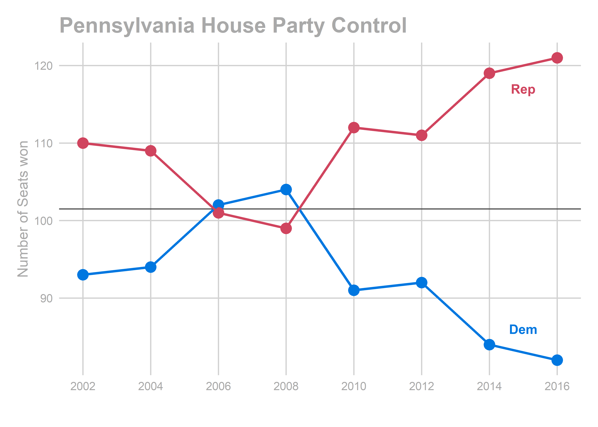

In 2016, Republicans increased their dominance of the house to **39 seats**.


```r
library(sf)
library(rgeos)

sth_11 <- st_read(
  "data/state_house/tigris_lower_house_2011.shp", 
  quiet=TRUE
) %>%
  mutate(vintage="<=2012")

sth_15 <- st_read(
  "data/state_house/tigris_lower_house_2015.shp", 
  quiet=TRUE
) %>%
  mutate(vintage=">2012")

sth_sf <- rbind(sth_11, sth_15) %>% rename(sth = SLDLST)
sth_pts <- mapply(st_centroid, sth_sf$geometry) %>% t
sth_sf <- sth_sf %>% mutate(x=sth_pts[,1], y=sth_pts[,2])

pa_union <- st_read("data/congress/tigris_usc_2015.shp") %>% 
  st_union() %>% 
  st_transform(st_crs(sth_15))
```

```
## Reading layer `tigris_usc_2015' from data source `\\jove.design.upenn.edu\home\staff-admin\PRAX\sydng\My Documents\UrbanSpatial\sixtysixwards_musa_workshop\ElectionAnalyticsWorkshop\data\congress\tigris_usc_2015.shp' using driver `ESRI Shapefile'
## Simple feature collection with 18 features and 12 fields
## geometry type:  POLYGON
## dimension:      XY
## bbox:           xmin: 1189586 ymin: 140905.3 xmax: 2814854 ymax: 1165942
## epsg (SRID):    NA
## proj4string:    +proj=lcc +lat_1=40.96666666666667 +lat_2=39.93333333333333 +lat_0=39.33333333333334 +lon_0=-77.75 +x_0=600000.0000000001 +y_0=0 +datum=NAD83 +units=us-ft +no_defs
```

```r
sth_vintage <- data.frame(
  year = seq(2002, 2018, 2)
) %>% mutate(vintage = ifelse(year <= 2012, "<=2012", ">2012"))

ggplot(
  sth_sf %>%
    filter(vintage == ">2012") %>%
    left_join(
      vote_df %>% filter(year == 2016)
    )
) +
  geom_sf(fill="white") +
  geom_point(
    aes(
      x=x,
      y=y,
      color = (sth_pctdem > 0.5), 
      alpha = abs(sth_pctdem - 0.5)
    ),
    pch=16,
    size=4
  ) +
  scale_color_manual(
    values = c("TRUE"=strong_blue, "FALSE"=strong_red),
    guide=FALSE
  ) +
  scale_alpha_continuous(range=c(0,0.5), guide=FALSE) +
  theme_map_sixtysix() +
  ggtitle("State House 2016 Results")
```


They did so with a ton of races between 55-70% Republican, the kind of races that might be in play in a D+9 election FiveThirtyEight was predicting.  


```r
ggplot(
  vote_df %>% 
    filter(year == 2016),
  aes(x=sth_pctdem, fill=(sth_pctdem > 0.5))
) +
  geom_histogram(boundary = 0.5, binwidth = 0.05) +
  scale_fill_manual(
    values=c("TRUE"=strong_blue, "FALSE"=strong_red),
    guide=FALSE
  ) +
  theme_sixtysix() +
  ggtitle("State House 2016 results")
```


Flashback to October 2018. As we enter the 2018 election, it's nationally clear that Democrats are going to have a strong election. But how strong? And how will that translate down to these State Races? Simply put: do Democrats have a shot to take back the PA House?

In this post we'll predict the outcomes of the race.

## Overview of the Data
The main dataframe:
**`vote_df`**: a data.frame with a row for each race. It includes lagged variables from prior elections, cross-walked where necessary.

```r
vote_df %>% filter(year == 2016) %>% head %>% as.data.frame()
```

```
##                 race sth                DEM_candidate DEM_is_incumbent
## 1   2016 G STH STH-1 001      PATRICK J HARKINS (STH)             TRUE
## 2  2016 G STH STH-10 010        JARET A GIBBONS (STH)             TRUE
## 3 2016 G STH STH-100 100       DALE ALLEN HAMBY (STH)            FALSE
## 4 2016 G STH STH-101 101 LORRAINE HELEN SCUDDER (STH)            FALSE
## 5 2016 G STH STH-102 102           JACOB H LONG (STH)            FALSE
## 6 2016 G STH STH-103 103            PATTY H KIM (STH)             TRUE
##   DEM_votes_sth                REP_candidate REP_is_incumbent
## 1         14785         WILLIAM CROTTY (STH)            FALSE
## 2         11224 AARON JOSEPH BERNSTINE (STH)            FALSE
## 3          6140         BRYAN D CUTLER (STH)             TRUE
## 4          9752    FRANCIS XAVIER RYAN (STH)            FALSE
## 5          8549      RUSSELL H DIAMOND (STH)             TRUE
## 6         20846                         <NA>               NA
##   REP_votes_sth sth_pctdem incumbent_is_dem dem_is_uncontested year
## 1          5491  0.7291872                1                  0 2016
## 2         15807  0.4152270                1                  0 2016
## 3         17416  0.2606555               -1                  0 2016
## 4         19800  0.3299946                0                  0 2016
## 5         19858  0.3009469               -1                  0 2016
## 6            NA  1.0000000                1                  1 2016
##   usc_pctdem uspgov_pctdem_statewide usc_pctdem_statewide
## 1  0.3487901               0.4962162            0.4588045
## 2  0.3736409               0.4962162            0.4588045
## 3  0.4334167               0.4962162            0.4588045
## 4  0.4093855               0.4962162            0.4588045
## 5  0.4100933               0.4962162            0.4588045
## 6  0.3459720               0.4962162            0.4588045
##   sth_pctdem_lagged uspgov_pctdem_lagged sth_frac_contested_lagged
## 1         1.0000000            0.7252871                         0
## 2         1.0000000            0.5103014                         0
## 3         0.0000000            0.3410035                         0
## 4         0.2932679            0.4109548                         1
## 5         0.3671351            0.3575663                         1
## 6         1.0000000            0.7775791                         0
##   uspgov_pctdem_statewide_lagged usc_pctdem_statewide_lagged
## 1                      0.5493505                   0.4446998
## 2                      0.5493505                   0.4446998
## 3                      0.5493505                   0.4446998
## 4                      0.5493505                   0.4446998
## 5                      0.5493505                   0.4446998
## 6                      0.5493505                   0.4446998
```

### Exercise 1: Fit a Model
Pause here, and fit a model to predict `sth_pctdem` using `vote_df`. 

## Our model
*NOTE: This is different from the model I actually used to make my predictions. I've cleaned up the data significantly, and improved the method using my [lessons learned](https://sixtysixwards.com/home/the-state-house-model-did-really-well-but-it-was-broken/). It's what I wish I'd done.*

Let's call $sth_{yr}$ the two-party percent of the vote for the Democrat for State House in year $y$ in race $r$.

### Using contemporaneous data
To predict an election, there are obviously useful covariates: historical results in the district, incumbency, four-year cycles. But the easy data leaves a gaping hole: all of the races can swing together from election to election. That is, years have large "random effects". 

In a best case scenario, we would have polls of voters on the State House races. Then we could capture simple-seeming things that our data has no idea of: How charismatic is a candidate? Are they well organized? Have they been running ads? Polls are what FiveThirtyEight uses, and why they get such good predictions. Of course, noboday actually publicly polls the 203 PA State House races.

In a worst case scenario, we would have to use only data from prior elections. This would leave us completely unable to predict large swings in public sentiment, and we would have to expand our uncertainty to capture the full range of election-level random effects (aka the way that all races are correlated from year to year). Imagine trying to predict the 2018 election using only the 2016 and 2014 results, without any data from 2018 that signaled Something Is Different. We would need to produce predictions capable of saying both "maybe this year is like 2010" and "maybe this year is like 2006".

Luckily, we are somewhere in between. While we don't have polling on this year's State House races, we do have polling on the US Congressional races. To the extent that USC races are correlated with STH races (probably a lot), we can use the USC polls to estimate the overall tenor of the race. Better yet, we don't have to actually use polling data itself, because FiveThirtyEight has already translated them into predicted votes. 


### The model
Here's the plan: model the results in a State House race as a function of past results in that district along with the US Congress results *in that year*.


```r
contested_form <- sth_pctdem ~ 1 +
  sth_pctdem_lagged +
  incumbent_is_dem +
  incumbent_is_running:sth_pctdem_lagged +
  usc_pctdem + 
  usc_pctdem_statewide +
  I(uspgov_pctdem_lagged - uspgov_pctdem_statewide_lagged)
```

where `incumbent_is_dem` is $1$ if the democratic candidate is an incumbent, $-1$ if the republican is, and $0$ otherwise; `usc_pct_dem` is the result in the entire USC district that the race belongs to (as opposed to just in the precinct); the `usc_pctdem_statewide` is the state-wide USC result (weighted by votes); and `uspgov_pctdem` is the result of either the USP or the GOV race, whichever occurred that year. 

One thing to note is that I don't include year-level random effects in this specification. But we'll be careful about year-level effects later. We only have a few years in the dataset (we'll be able to use 7), so we don't want to use too many year-level covariates (I have two: the intercept and the statewide vote for USC). On the other hand, we have 203 races per year, so we can include a ton of covariates that vary across races: incumbency, past results, USC results for specific districts.

The above model will work well for races where everything was contested, but we clearly shouldn't include uncontested races: we already know what those results will be, and the historical 100%s could mess up our other estimates. So we'll do two things: for races that are uncontested in year $y$, we will not model them at all, since we know the running candidate will win 100% of the vote. For races that were not contested last cycle but are contested this year, we will model them entirely separately, using a different equation:

**Model for formerly uncontested races:**

```r
uncontested_form <- sth_pctdem ~ 1 + 
  dem_won_lagged + 
  incumbent_is_running +
  dem_won_lagged:incumbent_is_running +
  usc_pctdem + 
  usc_pctdem_statewide +
  I(uspgov_pctdem_lagged - uspgov_pctdem_statewide_lagged)
```

### Bootstrapping
To generate uncertainty and cross-validate, we'll bootstrap.

We won't naively do row-level bootstrapping. I'm seriously worried that there could be systematic swings from election to election (aka election-level random effects or interactions). By only bootstrapping the rows, we would be cheating then: we would actually always have observations from every election, and never get real uncertainty of election-level randomness.

Instead, we want the Multiway Bootstrap. We'll bootstrap at the year-level where we think effects are plausibly independent. Notice that this takes our N down from 203 * 7 races down to 7 years. Oof.

Here's my approach: I'll fit the model by bootstrapping years. In order to validate, we'll walk through holding out each election as our test set. We only have seven elections to do this for (2004 - 2016; we can't use 2002 since we need lagged data), but hopefully that's enough to spot bad behaviors. This isn't the best practice of never touching a test set, but when N=7 you can't do best practices. Instead, I claim I've chosen a super conservative approach, and we'll need to be honest about not overfitting the data.

### Crosswalking

Before we get to fitting the model, an aside. Remember that some of the lagged data required crosswalking. Thus, some of the lagged historic races may be *fractionally contested*: some of the area may have had uncontested races, and others contested. 


```r
hist(vote_df$sth_frac_contested_lagged)
```


I'm going to arbitrarily call you uncontested if half of the population or more lived in races that were uncontested last cycle. \_shrugemoji\_

Ok, fit the model.

## Fitting the model

We'll build up our helper functions to fit the model. First, we'll write `fit_once`, which fits a single model for a single year. 

Then we'll write `bootstrap`, which bootstraps years of the data.frame, and runs `fit_once` many times, generating bootstrapped predictions for a single holdout year.

Finally, we'll loop through each year as a holdout, getting `bootstrap`ed results for each.

Let's create an S4 class to hold our results. The result of a single model fit will return the following: 
- Integer `holdout_year`.
- A data.frame with the predicted mean outcome of STH; columns `sth`, `sth_pctdem`, `pred`.
- A data.frame with the predictions for the test set plus random noise of the appropriate size, to serve in our full prediction interval.  
- A tidy dataframe with the coefficients of the regression fits. 
- A dataframe with generic summary stats we can add later


```r
setClass(
  "FitResult",
  representation(
    holdout_year = "integer",
    pred = "data.frame",
    test_sample = "data.frame",
    coefs = "data.frame",
    summary_stats = "data.frame"
  )
)
```

We'll also create an S4 class called Condition, which contains how to split up the data into models (for us, "contested", "uncontested", and "previously_uncontested").


```r
setClass(
  "Condition",
  slots=c(
    name="character",
    formula="formula",
    filter_func="function", ## a function of df that returns vector of TRUE/FALSE
    warn="logical"  ## should the model warn if the fit raises a warning?
  )
)

conditions <- c(
  new(
    "Condition", 
    name="uncontested", 
    formula=sth_pctdem ~ sign(dem_is_uncontested), 
    filter_func=function(df) abs(df$dem_is_uncontested) == 1,
    warn=FALSE
  ),
  new(
    "Condition", 
    name="previously_uncontested", 
    formula=uncontested_form, 
    filter_func=function(df) {
      abs(df$dem_is_uncontested) != 1 & df$sth_frac_contested_lagged <= 0.5
    },
    warn=TRUE
  ),
  new(
    "Condition", 
    name="contested", 
    formula=contested_form, 
    filter_func=function(df) {
      abs(df$dem_is_uncontested) != 1 & df$sth_frac_contested_lagged > 0.5
    },
    warn=TRUE
  )
)

add_cols <- function(df0){
  df0$dem_won_lagged <- df0$sth_pctdem_lagged > 0.5
  df0$incumbent_is_running <- abs(df0$incumbent_is_dem)
  df0$uspgov_is_usp <- (asnum(df0$year) %% 4) == 0
  df0
}

vote_df <- vote_df %>% add_cols

get_holdout_set <- function(df0, holdout_year){
  ifelse(df0$year %in% holdout_year, "test", "train")
}

add_condition <- function(df0, conditions){
  df0$condition <- NA
  for(condition in conditions){
    if(!is(condition, "Condition")) stop("condition is not of class Condition")
    df0$condition[condition@filter_func(df0)] <- condition@name
  }
  
  if(any(is.na(df0$condition))) warning("the conditions don't cover the full dataset")

  return(df0)
}

## can't use 2002 since it doesn't have lagged data
vote_df <- vote_df %>% filter(year > 2002)
vote_df <- vote_df %>% add_condition(conditions)
```

Let's define `fit_once`:

```r
fit_once <- function(df0, holdout_year, conditions, verbose = TRUE){
  df0$set <- get_holdout_set(df0, holdout_year)
  df0$pred <- NA
  
  coef_results <- list()
  sd_err <- list()
  for(cond in conditions){
    if(!cond@warn) wrapper <- suppressWarnings else wrapper <- identity 
    
    fit <- wrapper(
      lm(
        cond@formula, 
        data = df0 %>% filter(condition == cond@name & set == "train")
      )
    )
    
    sd_err[cond@name] <- sd(fit$residuals)
    coef_results[[cond@name]] <- broom::tidy(fit) %>% 
      mutate(condition=cond@name)
    
    df0$pred[df0$condition == cond@name] <- predict(
      fit, 
      newdata = df0[df0$condition == cond@name,]
    )

    if(verbose) {
      print(sprintf("%s Model", cond@name))
      print(wrapper(summary(fit))) 
    }
  }

  ## estimate sd of year random effects
  year_re <- df0 %>% 
    filter(condition != "uncontested" & set == "train") %>%
    group_by(year) %>%
    summarise(re = mean(sth_pctdem - pred))
  year_sd <- sd(year_re$re)
  resid_sd <- sapply(
    sd_err[names(sd_err) != "uncontested"], 
    function(e) sqrt(e^2 - year_sd^2)
  )
  
  summary_stat_df <- data.frame(
    stat = c("year_sd", paste0("resid_sd_", names(resid_sd))),
    value = c(year_sd, unlist(resid_sd))
  )
  
  ## this is a noisy estimate, where we generate a sample with year effect and residual noise
  sample <- df0 %>%
    filter(set == 'test') %>%
    mutate(
      pred_samp = pred + 
        ifelse(
          condition == "uncontested", 0,
          rnorm(n(), mean=0, sd=resid_sd[condition]) +
            rnorm(1, mean=0, sd=year_sd)
        )
    ) %>%
    select(race, sth, condition, pred, pred_samp)
  
  return(new(
    "FitResult",
    pred=df0[,c("sth", "year", "pred")],
    coefs=do.call(rbind, coef_results),
    test_sample=sample,
    holdout_year=as.integer(holdout_year),
    summary_stats=summary_stat_df
  ))
}

results_once <- fit_once(
  vote_df, 
  2016, 
  conditions
)
```

```
## [1] "uncontested Model"
## 
## Call:
## lm(formula = cond@formula, data = df0 %>% filter(condition == 
##     cond@name & set == "train"))
## 
## Residuals:
##        Min         1Q     Median         3Q        Max 
## -5.980e-16 -5.980e-16  0.000e+00  0.000e+00  1.103e-13 
## 
## Coefficients:
##                           Estimate Std. Error   t value Pr(>|t|)    
## (Intercept)              5.000e-01  2.207e-16 2.265e+15   <2e-16 ***
## sign(dem_is_uncontested) 5.000e-01  2.207e-16 2.265e+15   <2e-16 ***
## ---
## Signif. codes:  0 '***' 0.001 '**' 0.01 '*' 0.05 '.' 0.1 ' ' 1
## 
## Residual standard error: 5.279e-15 on 570 degrees of freedom
## Multiple R-squared:      1,	Adjusted R-squared:      1 
## F-statistic: 5.132e+30 on 1 and 570 DF,  p-value: < 2.2e-16
## 
## [1] "previously_uncontested Model"
## 
## Call:
## lm(formula = cond@formula, data = df0 %>% filter(condition == 
##     cond@name & set == "train"))
## 
## Residuals:
##       Min        1Q    Median        3Q       Max 
## -0.212129 -0.033724  0.001324  0.046809  0.181318 
## 
## Coefficients:
##                                                          Estimate
## (Intercept)                                               0.19135
## dem_won_laggedTRUE                                        0.08741
## incumbent_is_running                                     -0.06921
## usc_pctdem                                                0.17552
## usc_pctdem_statewide                                      0.38672
## I(uspgov_pctdem_lagged - uspgov_pctdem_statewide_lagged)  0.49349
## dem_won_laggedTRUE:incumbent_is_running                   0.12429
##                                                          Std. Error
## (Intercept)                                                 0.05758
## dem_won_laggedTRUE                                          0.02075
## incumbent_is_running                                        0.01417
## usc_pctdem                                                  0.05105
## usc_pctdem_statewide                                        0.11606
## I(uspgov_pctdem_lagged - uspgov_pctdem_statewide_lagged)    0.05359
## dem_won_laggedTRUE:incumbent_is_running                     0.02236
##                                                          t value Pr(>|t|)
## (Intercept)                                                3.323 0.001062
## dem_won_laggedTRUE                                         4.213 3.84e-05
## incumbent_is_running                                      -4.886 2.14e-06
## usc_pctdem                                                 3.438 0.000716
## usc_pctdem_statewide                                       3.332 0.001030
## I(uspgov_pctdem_lagged - uspgov_pctdem_statewide_lagged)   9.208  < 2e-16
## dem_won_laggedTRUE:incumbent_is_running                    5.559 8.80e-08
##                                                             
## (Intercept)                                              ** 
## dem_won_laggedTRUE                                       ***
## incumbent_is_running                                     ***
## usc_pctdem                                               ***
## usc_pctdem_statewide                                     ** 
## I(uspgov_pctdem_lagged - uspgov_pctdem_statewide_lagged) ***
## dem_won_laggedTRUE:incumbent_is_running                  ***
## ---
## Signif. codes:  0 '***' 0.001 '**' 0.01 '*' 0.05 '.' 0.1 ' ' 1
## 
## Residual standard error: 0.06574 on 196 degrees of freedom
## Multiple R-squared:  0.871,	Adjusted R-squared:  0.8671 
## F-statistic: 220.6 on 6 and 196 DF,  p-value: < 2.2e-16
## 
## [1] "contested Model"
## 
## Call:
## lm(formula = cond@formula, data = df0 %>% filter(condition == 
##     cond@name & set == "train"))
## 
## Residuals:
##       Min        1Q    Median        3Q       Max 
## -0.171925 -0.040997  0.000342  0.038763  0.184274 
## 
## Coefficients:
##                                                           Estimate
## (Intercept)                                               0.088905
## sth_pctdem_lagged                                         0.488134
## incumbent_is_dem                                          0.059975
## usc_pctdem                                                0.021814
## usc_pctdem_statewide                                      0.325711
## I(uspgov_pctdem_lagged - uspgov_pctdem_statewide_lagged)  0.330569
## sth_pctdem_lagged:incumbent_is_running                   -0.011987
##                                                          Std. Error
## (Intercept)                                                0.038633
## sth_pctdem_lagged                                          0.032938
## incumbent_is_dem                                           0.004633
## usc_pctdem                                                 0.030635
## usc_pctdem_statewide                                       0.073762
## I(uspgov_pctdem_lagged - uspgov_pctdem_statewide_lagged)   0.035356
## sth_pctdem_lagged:incumbent_is_running                     0.014148
##                                                          t value Pr(>|t|)
## (Intercept)                                                2.301   0.0218
## sth_pctdem_lagged                                         14.820  < 2e-16
## incumbent_is_dem                                          12.945  < 2e-16
## usc_pctdem                                                 0.712   0.4768
## usc_pctdem_statewide                                       4.416 1.27e-05
## I(uspgov_pctdem_lagged - uspgov_pctdem_statewide_lagged)   9.350  < 2e-16
## sth_pctdem_lagged:incumbent_is_running                    -0.847   0.3973
##                                                             
## (Intercept)                                              *  
## sth_pctdem_lagged                                        ***
## incumbent_is_dem                                         ***
## usc_pctdem                                                  
## usc_pctdem_statewide                                     ***
## I(uspgov_pctdem_lagged - uspgov_pctdem_statewide_lagged) ***
## sth_pctdem_lagged:incumbent_is_running                      
## ---
## Signif. codes:  0 '***' 0.001 '**' 0.01 '*' 0.05 '.' 0.1 ' ' 1
## 
## Residual standard error: 0.05923 on 436 degrees of freedom
## Multiple R-squared:  0.8763,	Adjusted R-squared:  0.8746 
## F-statistic: 514.9 on 6 and 436 DF,  p-value: < 2.2e-16
```

We've fit the model once, using 2016 as the holdout. Let's examine the results.

First, make sure the coefficients of the models make sense to you. They're purposefully simple models, where we just estimate the correlation of State House results a bunch of other races, past and present. 

*Contested Model:* All of the obvious culprits have positive correlations: the lagged STH results, incumbent party, USC results statewide, and lagged USP/GOV results from the district (relative to statewide). Interestingly, the interaction is insignificant: knowing that the incumbent is running doesn't make the last election's results any more pertinent.

*Uncontested Model:* Similarly, these results are what we expected. Notice that the coefficient of `incumbent_is_running` means that a Republican incumbent gets a 6.9 point boost, whereas `incumbent_is_running + dem_won_laggedTRUE:incumbent_is_running` means a Democratic incumbent gets a 5.5 point boost, so both are positive.

Second, let's plot the prediction.

```r
supplement_pred <- function(pred, holdout_year, df0=vote_df){
  pred_supplemented <- pred %>% left_join(
    df0 %>% 
      mutate(set = get_holdout_set(., holdout_year)) %>%
      select(sth, year, race, condition, set, sth_pctdem),
    by = c("sth", "year")
  )
  if(!nrow(pred) == nrow(pred_supplemented)) stop("rows were duplicated")
  return(pred_supplemented)
}

supplement_pred_from_fit <- function(fr, df0=vote_df){
  supplement_pred(fr@pred, fr@holdout_year, df0)
}

prediction_plot <- function(fr, condition_name){
  if(!is(fr, "FitResult")) stop("fr must be of type FitResult")
  if(!condition_name %in% unique(fr@coefs$condition)) {
    stop("condition doesn't match available conditions")
  }
  ggplot(
    fr %>% 
      supplement_pred_from_fit() %>%
      filter(condition == condition_name),
    aes(x = pred, y = sth_pctdem)
  ) +
    geom_point() +
    geom_abline(slope=1, intercept=0) +
    geom_hline(yintercept = 0.5, color = "grey50")+
    geom_vline(xintercept = 0.5, color = "grey50")+
    facet_grid(~set) +
    coord_fixed() +
    ggtitle(sprintf("Predicted values of %s model, %s", condition_name, fr@holdout_year))
}


prediction_plot(results_once, "contested")
```


```r
prediction_plot(results_once, "previously_uncontested")
```


```r
prediction_plot(results_once, "uncontested")
```


Looks ok. 

Now, let's bootstrap the races, still sticking to a single year. 


```r
setClass(
  ## BootstrapResult is like FitResult but dfs will have column `sim`
  "BootstrapResult",
  slots=c(
    nboot="numeric"
  ),
  contains="FitResult"  
)

rbind_slots <- function(obj_list, result_slot){
  bind_rows(
    lapply(obj_list, slot, result_slot),
    .id = "sim"
  )
}

construct_bsresult <- function(fitresult_list){
  nboot <- length(fitresult_list)
  holdout_year <- unique(sapply(fitresult_list, slot, "holdout_year"))
  bs <- new("BootstrapResult", nboot=nboot, holdout_year=as.integer(holdout_year))
  for(sl in c("pred","coefs","test_sample")){
    slot(bs, sl) <- rbind_slots(fitresult_list, sl)
  }
  return(bs)
}

bootstrap <- function(df0, holdout_year, conditions, nboot=500, verbose=TRUE, ...){
  fitresult_list <- list()
  years <- as.character(seq(2004, 2016, 2))
  train_years <- years[!years %in% holdout_year]
  n_train_years <- length(years)
  df0 <- df0 %>% mutate(year = as.character(year))
  
  for(i in 1:nboot){
    bs_year_samp <- data.frame(year = sample(train_years, replace=TRUE))
    bsdf <- rbind(
      bs_year_samp %>% left_join(df0, by = "year"),
      df0 %>% filter(get_holdout_set(., holdout_year) == "test")
    )
    fitresult_list[[i]] <- fit_once(bsdf, holdout_year, conditions, verbose=FALSE, ...)
    if(verbose & (i %% 100 == 0)) print(i)
  }

  return(
    construct_bsresult(fitresult_list)
  )
}

bs <- bootstrap(
  vote_df, 
  2016, 
  conditions,
  verbose=TRUE
)
```

```
## [1] 100
## [1] 200
## [1] 300
## [1] 400
## [1] 500
```

Let's see how we did. First, do the coefficients make sense?

```r
coef_plot <- function(bs, condition_name='contested'){
  coef_df <- bs@coefs %>% 
    filter(condition == condition_name)
  
  ggplot(
      coef_df, 
      aes(x=term, y=estimate)
  ) + 
    geom_boxplot(outlier.color = NA) +
    theme_sixtysix() +
    theme(axis.text.x = element_text(angle = 90, hjust=1, vjust=0.5)) +
    ylim(-1,1)+
    ggtitle(
      paste("Coefficients of", condition_name),
      paste("Holdout:", bs@holdout_year)
    )
}

coef_plot(bs, 'contested')
```


```r
coef_plot(bs, 'previously_uncontested')
```

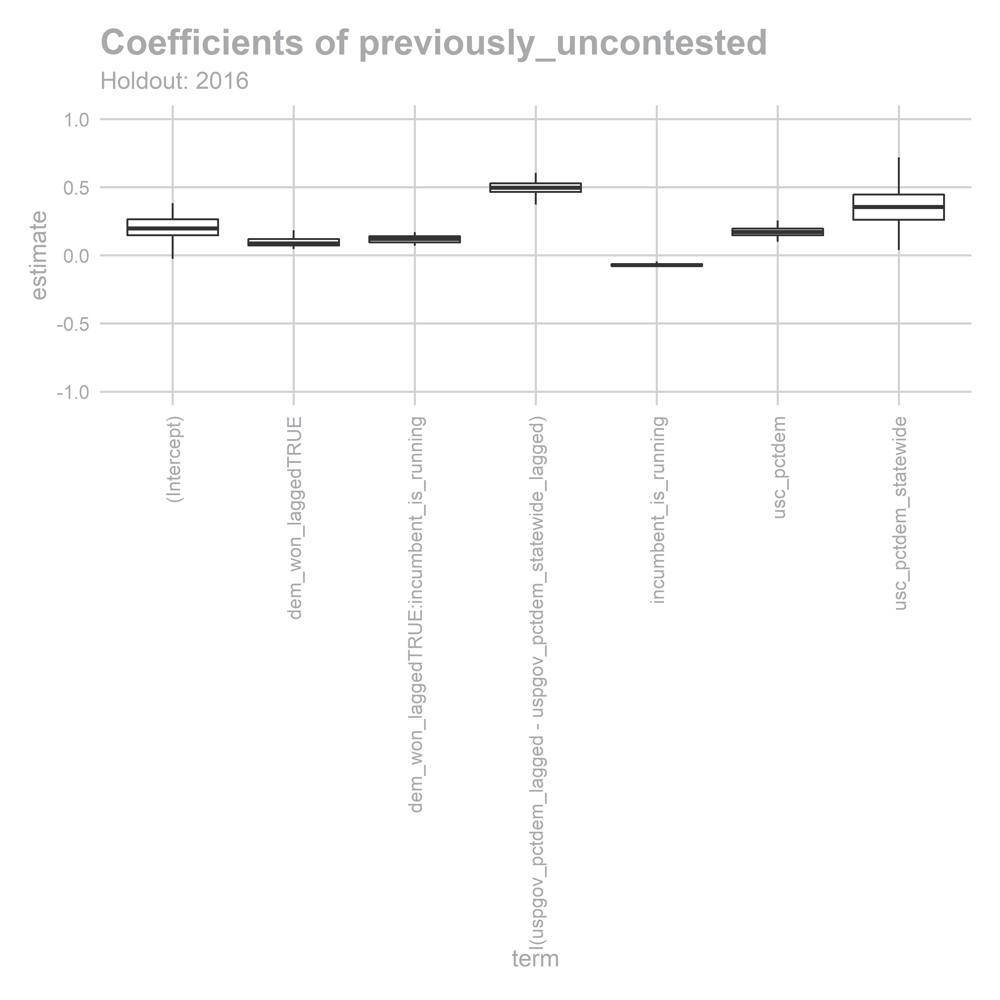

```r
coef_plot(bs, 'uncontested')
```


Sure.

How did the predictions perform? Let's look at individual races.

```r
get_pred_with_true_results <- function(bs){
  true_results <- bs@pred %>%
    filter(year == bs@holdout_year) %>%
    supplement_pred(bs@holdout_year)
  true_results
}

gg_race_pred <- function(bs){
  holdout_year <- bs@holdout_year
  
  true_results <- get_pred_with_true_results(bs)
    
  race_order <- bs@test_sample %>% 
    group_by(race) %>%
    summarise(m = mean(pred_samp)) %>%
    with(race[order(m)])

  ggplot(
    bs@test_sample %>% mutate(race = factor(race, levels = race_order)), 
    aes(x=race, y=pred_samp)
  ) +
    geom_hline(yintercept=0.5, size=1, color = 'grey30')+
    geom_boxplot(outlier.colour = NA, alpha = 0.5)+
    geom_point(
      data = true_results,
      aes(y=sth_pctdem),
      color="blue"
    ) +
    theme_sixtysix()+
    theme(
      panel.grid.major.x = element_blank(),
      axis.text.x = element_blank()
    ) +
    xlab("race (sorted by predicted pct dem)") +
    scale_y_continuous("pct dem", breaks = seq(0,1,0.25))+
    ggtitle(paste("Race-by-race predictions for", holdout_year), "Blue is actual results.")
}

gg_race_pred(bs)
```


Looks ok. Nothing insane.

### Exercise 2: Make a diagnostic plot

Pause here, and make your own diagnostic plot of the results.

### More diagnostics

Another way to look at the results is as a scatterplot of predicted versus actual results (we'll only do this for the holdout).

```r
gg_race_scatter <- function(bs){
  holdout_year <- bs@holdout_year
  
  true_results <- get_pred_with_true_results(bs)

  ggplot(
    bs@test_sample %>% 
      group_by(race, sth, condition) %>%
      summarise(
        ymean = mean(pred_samp),
        ymin = quantile(pred_samp, 0.025),
        ymax = quantile(pred_samp, 0.975)
      ) %>%
      left_join(true_results), 
    aes(x=sth_pctdem, y=ymean)
  ) +
    geom_abline(slope=1, size=1, color = 'grey30')+
    geom_linerange(
      aes(ymin=ymin, ymax=ymax, group=race)
    )+
    geom_point(
      aes(y=ymean, color=condition)
    ) +
    theme_sixtysix()+
    xlab("True Result") +
    scale_y_continuous("Prediction", breaks = seq(0,1,0.25))+
    coord_fixed() +
    ggtitle("Race prediction intervals", holdout_year)
}

gg_race_scatter(bs)
```

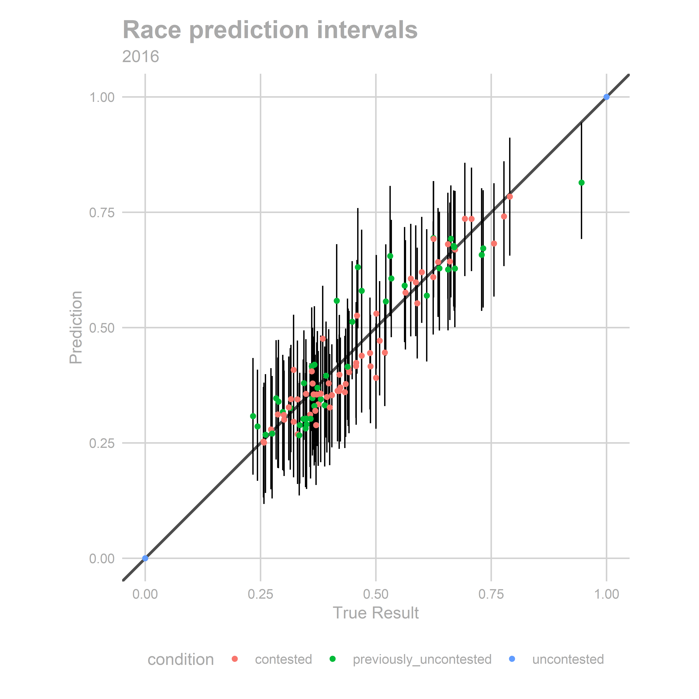

How about the percentiles of the true results with respect to the predicted distribution? These should be uniform. 

```r
gg_resid <- function(bs){
  holdout_year <- bs@holdout_year
  true_results <- get_pred_with_true_results(bs)
  pctl <- bs@test_sample %>%
    filter(condition != "uncontested") %>%
    left_join(true_results) %>%
    group_by(race, sth, condition) %>%
    summarise(pctl = mean(sth_pctdem > pred_samp))
    
  ggplot(pctl, aes(x=pctl, fill = condition)) + 
    geom_histogram(binwidth = 0.05) +
    scale_fill_manual(
      values = c(
        contested = strong_green, 
        previously_uncontested = strong_purple
      )
    ) +
    theme_sixtysix()
}
gg_resid(bs)
```


Maybe they're uniform. They're not obviously bad (you *know it* when they're obviously bad).

What if we map them?

```r
map_residuals <- function(bs, cond_name, df0=vote_df){
  holdout_year <- bs@holdout_year
  sf_vintage <- sth_vintage %>% filter(year==holdout_year) %>% with(vintage)
  sf <- sth_sf %>% filter(vintage == sf_vintage) 
  
  bs_pred <- bs@test_sample %>% 
    group_by(sth, race, condition) %>%
    summarise(
      pred = mean(pred)
    ) %>%
    left_join(df0 %>% select(race, sth_pctdem)) %>%
    mutate(resid = sth_pctdem - pred)
  
  ggplot(
    sf %>% 
      left_join(bs_pred %>% filter(condition == cond_name))
  ) +
    geom_sf(data = pa_union) +
    geom_point(
      aes(x=x, y=y, size=abs(resid), color=ifelse(resid < 0, "Dem", "Rep"))
    ) +
    scale_color_manual(
      values=c(Dem = strong_blue, Rep = strong_red), 
      guide=FALSE
    ) +
    scale_size_area(guide = FALSE) +
    theme_map_sixtysix() +
    ggtitle(
      paste("Residual Map for", holdout_year,",", cond_name,"model"),
      "Blue means Dem overpredicted, Red means Rep"
    )
}

map_residuals(bs, "contested")
```


```r
map_residuals(bs, "previously_uncontested")
```


There's a story here. Looks like we are systematically over-predicting the Dems in Philadelphia and Pittsburgh, and over-predicting Republicans in the immediate suburbs. We won't raise the alarm yet, and will check out the results across years.

Finally, what was our topline number?

```r
pivotal_bs <- function(x, q){
  mean_x <- mean(x)
  q0 <- 1 - q
  raw_quantiles <- quantile(x, q0)
  true_quantiles <- 2 * mean_x - raw_quantiles
  names(true_quantiles) <- scales::percent(q)
  return(true_quantiles)
}

gg_pred_hist <- function(bs, true_line=TRUE, df0=vote_df){
  holdout_year <- bs@holdout_year
  print("bootstrapped predictions")
  pred_total <- bs@test_sample %>% 
    group_by(sim) %>%
    summarise(n_dem_wins = sum(pred_samp > 0.5)) %>%
    group_by()
  print(paste("Total NA:", sum(is.na(pred_total$n_dem_wins))))
  
  pred_total <- pred_total %>% filter(!is.na(n_dem_wins))
  print(mean(pred_total$n_dem_wins))
  print(pivotal_bs(pred_total$n_dem_wins, c(0.025, 0.2, 0.8, 0.975)))
  
  if(true_line){
    print("actual results")
    true_dem_wins <- df0[df0$year == holdout_year,] %>% with(sum(sth_pctdem > 0.5))
    print(true_dem_wins)
    gg_annotation <- function() 
      annotate(
        geom="text",
        x = true_dem_wins,
        y = 10,
        angle = 90,
        hjust = 0,
        vjust = 1.1,
        label = paste("True outcome =", true_dem_wins)
      )
  } else {
    true_dem_wins <- numeric(0)
    gg_annotation <- geom_blank
  }
  
  ggplot(pred_total, aes(x = n_dem_wins, fill = n_dem_wins < 101.5)) + 
    geom_histogram(binwidth = 1) + 
    geom_vline(xintercept = true_dem_wins) +
    gg_annotation() +
    ggtitle(paste("Predicted Democratic seats in", holdout_year)) +
    xlab("N Democratic Seats") +
    ylab("N Bootstrap Sims") +
    theme_sixtysix() +
    scale_fill_manual(
      values = c(`TRUE`=strong_red, `FALSE` = strong_blue),
      guide = FALSE
    )
}

gg_pred_hist(bs)
```

```
## [1] "bootstrapped predictions"
## [1] "Total NA: 0"
## [1] 83.842
##   2.5%  20.0%  80.0%  97.5% 
## 75.684 80.684 86.684 91.684 
## [1] "actual results"
## [1] 82
```


We predicted Democrats would win 84 out of 203 seats, with a 95% CI of [76,92]. They actually won 82. \_sunglassesemoji\_

## Results for all years

Ok, now let's do the whole darn thing. We will run the same bootstrap above, but iterating through holding out each year.


```r
bs_years <- list()
for(holdout in seq(2004, 2016, 2)){
  print(paste("###", holdout, "###"))
  bs_years[[as.character(holdout)]] <- bootstrap(
    vote_df, 
    holdout, 
    conditions,
    verbose=FALSE
  )
}
```

```
## [1] "### 2004 ###"
## [1] "### 2006 ###"
## [1] "### 2008 ###"
## [1] "### 2010 ###"
## [1] "### 2012 ###"
## [1] "### 2014 ###"
## [1] "### 2016 ###"
```

Let's check the results!

```r
for(holdout in seq(2004, 2016, 2)){
  gg_pred_hist(bs_years[[as.character(holdout)]]) %>% print()
}
```

```
## [1] "bootstrapped predictions"
## [1] "Total NA: 0"
## [1] 95.972
##    2.5%   20.0%   80.0%   97.5% 
##  86.944  91.944  99.944 104.944 
## [1] "actual results"
## [1] 94
```

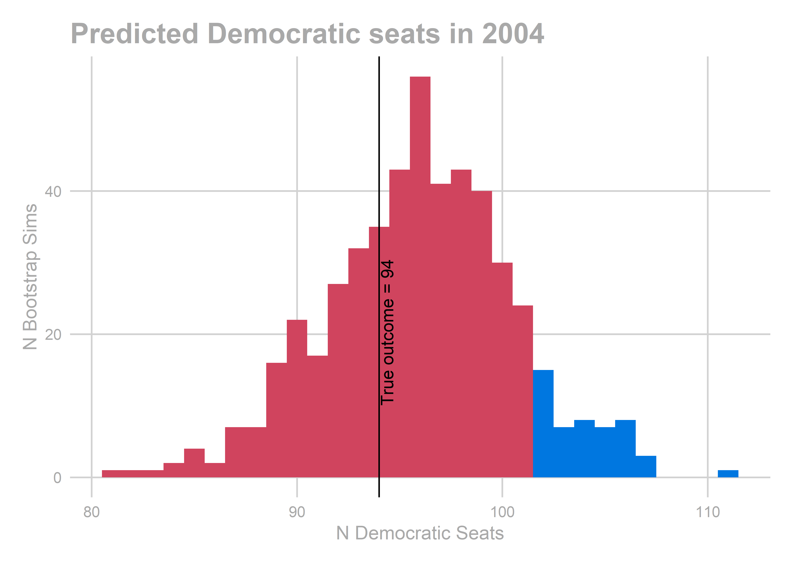

```
## [1] "bootstrapped predictions"
## [1] "Total NA: 0"
## [1] 102.502
##    2.5%   20.0%   80.0%   97.5% 
##  83.954  96.004 109.004 116.529 
## [1] "actual results"
## [1] 102
```

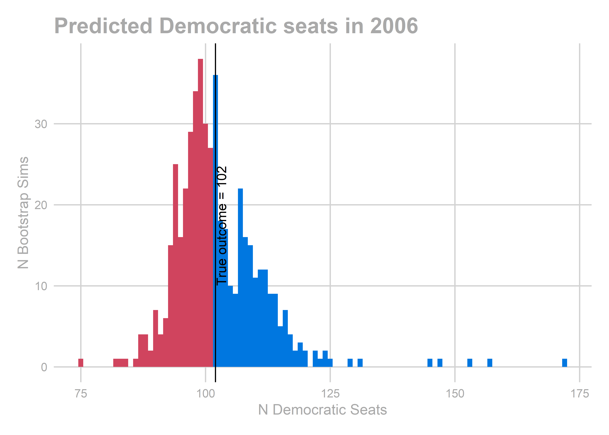

```
## [1] "bootstrapped predictions"
## [1] "Total NA: 1"
## [1] 114.2345
##     2.5%    20.0%    80.0%    97.5% 
## 100.4689 108.4689 118.4689 133.0189 
## [1] "actual results"
## [1] 104
```


```
## [1] "bootstrapped predictions"
## [1] "Total NA: 0"
## [1] 103.45
##    2.5%   20.0%   80.0%   97.5% 
##  96.375 100.900 105.900 109.900 
## [1] "actual results"
## [1] 91
```


```
## [1] "bootstrapped predictions"
## [1] "Total NA: 0"
## [1] 90.664
##    2.5%   20.0%   80.0%   97.5% 
##  82.803  87.328  94.328 101.853 
## [1] "actual results"
## [1] 92
```

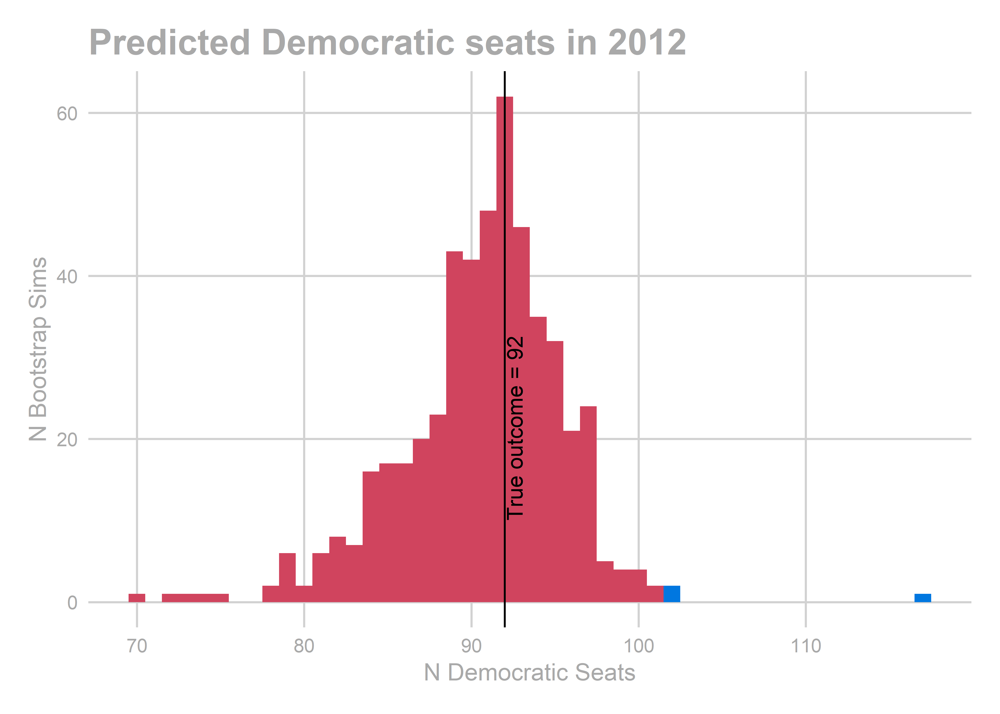

```
## [1] "bootstrapped predictions"
## [1] "Total NA: 0"
## [1] 86.854
##   2.5%  20.0%  80.0%  97.5% 
## 77.708 82.708 90.708 98.233 
## [1] "actual results"
## [1] 84
```


```
## [1] "bootstrapped predictions"
## [1] "Total NA: 0"
## [1] 84.054
##   2.5%  20.0%  80.0%  97.5% 
## 76.583 81.108 87.108 91.633 
## [1] "actual results"
## [1] 82
```

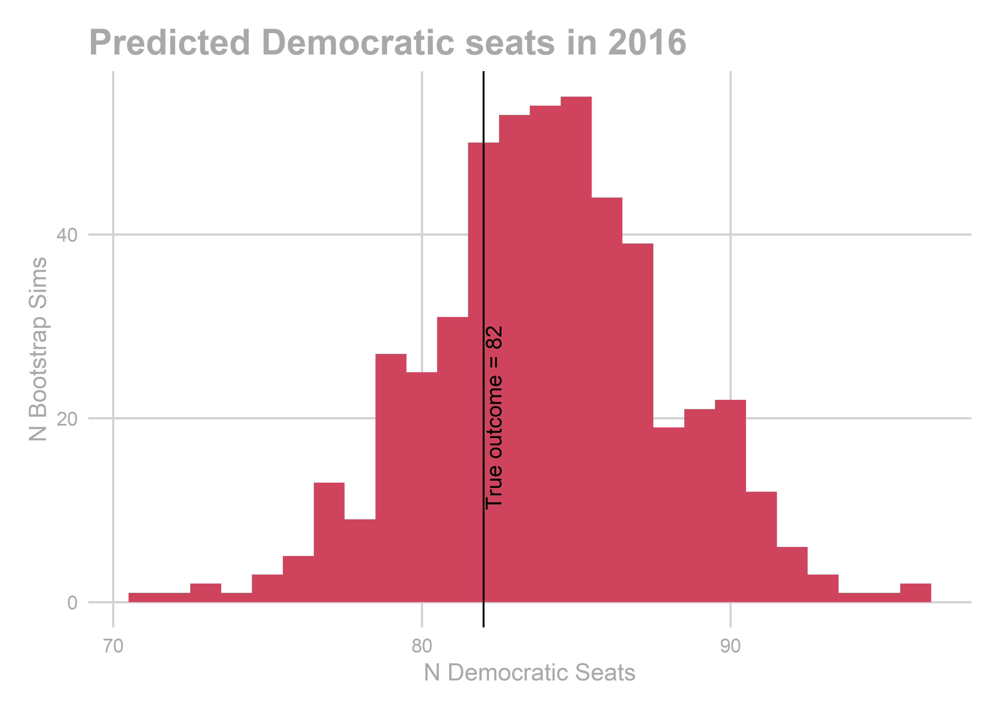

All of the years look okay... oof, except for 2010. That's bad. We predicted a Democratic win of 103-100, and in actuality Republicans won 112-91. 

Look at the race level predictions that year:

```r
gg_race_pred(bs_years[['2010']])
```

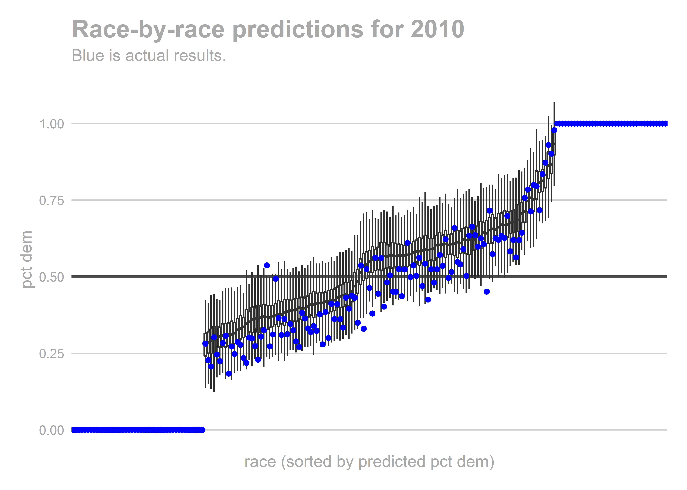

```r
gg_race_scatter(bs_years[['2010']])
```


```r
map_residuals(bs_years[['2010']], "contested")
```


```r
map_residuals(bs_years[['2010']], "previously_uncontested")
```

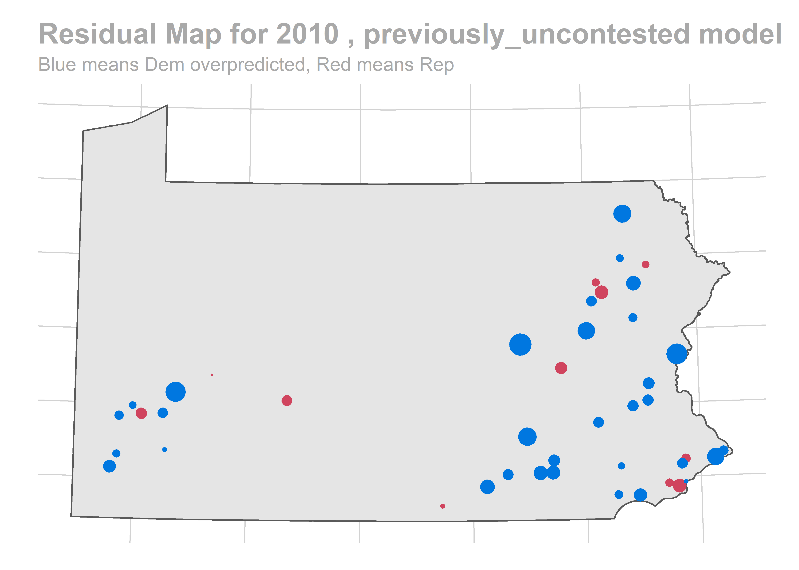
We aren't getting any single race terribly wrong, but we systematically over-predict Democratic performance across the board. What especially hurts is the middle of the plot, where we predict 60-40 Democratic wins and Republicans won 60-40 instead.

What happened?

Let's look at the coefficients of the models, by year.


```r
coef_df <- do.call(
  rbind,
  lapply(
    bs_years,
    function(bs) {
      bs@coefs %>% 
        group_by(term, condition) %>% 
        summarise(estimate=mean(estimate)) %>%
        mutate(year = bs@holdout_year)
    }
  )
)

ggplot(
  coef_df,
  aes(x = interaction(condition, term), y=estimate)
) + 
  geom_point(aes(color = (year == 2010))) +
  theme(axis.text.x = element_text(angle = 90, hjust = 1))
```

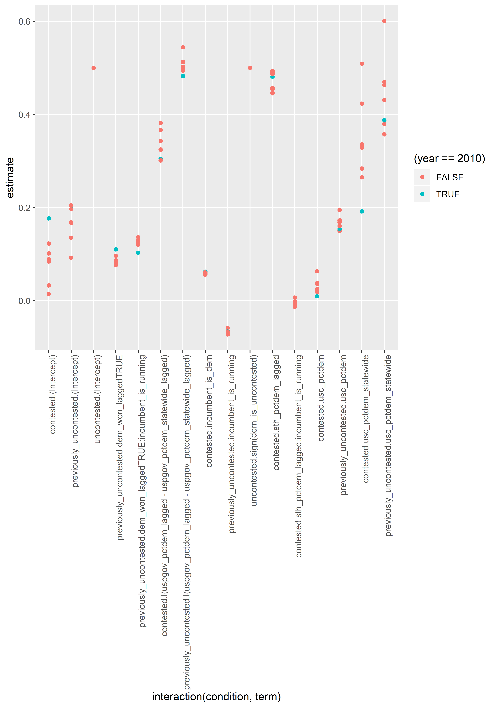

When we held out 2010, we estimated the single highest intercept (good for the Democrats), along with the lowest correlations of USC results and prior STH races. Then, when use those coefficients in 2010, a good year for Republicans, the model totall overshoots. Darn.

So what do we do? We have a few options.

- **Do nothing.** When we predict for 2018, 2010 will be in our training set, so we will have that coverage. Hopefully, 2018 won't be an outlier given  2004-2016 the way 2010 was for 2004-2016. FiveThirtyEight projects a Democratic USC win in 2018, but not out of line of other results we've seen, in 2006 ad 2008.

- **Be Bayesian.** Model the annual random effects and throw on a strong prior. This is my instinct, but I'm committed to being Frequentist for the workshop :)

- **Rejigger the formulas we use.** While it's a cardinal sin to retouch your model after evaluating a test set, we don't have enough years to use best practices (ideally we would create a super-holdout of years that we never looked at until the very end. But I'm not willing to throw out years when we only have seven). If we do this, we need to be intellectually honest with ourselves, and be super duper careful not to overfit the model. I attempt to achieve this by limiting myself to specifications that would only be a priori obvious, and that use only as many or fewer degrees of freedom as what I've already fit.

Let's do option one. We won't touch our model, and we'll hope that since 2010 is in our training data now, 2018 won't be a bad outlier.

For completeness, let's revisit the maps of residuals. Does it look like we systematically mis-predict a given region?


```r
for(bs in bs_years){
  for(condname in c("contested", "previously_uncontested")){
    map_residuals(bs, condname) %>% print
  }
}
```

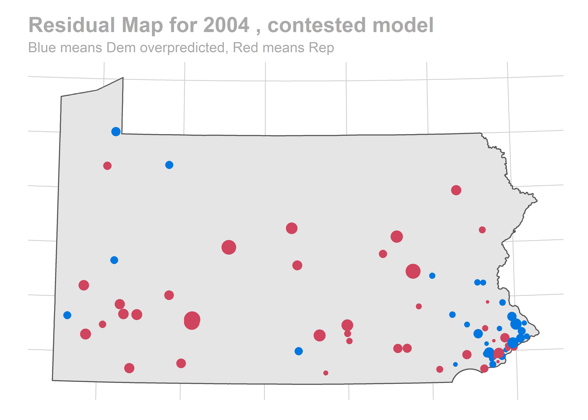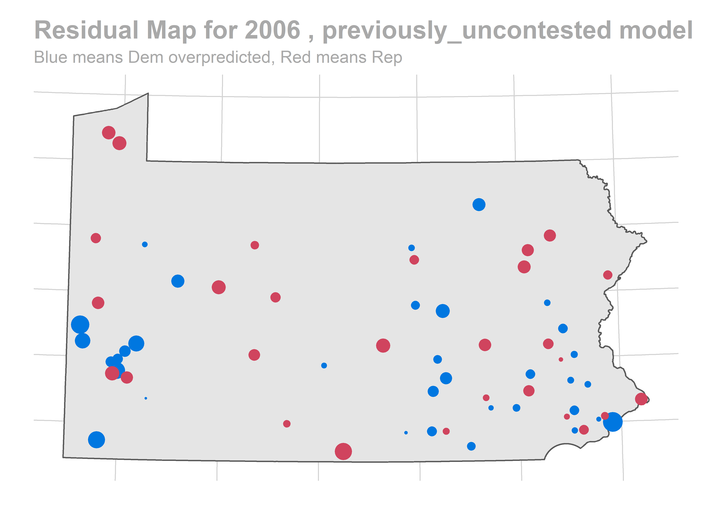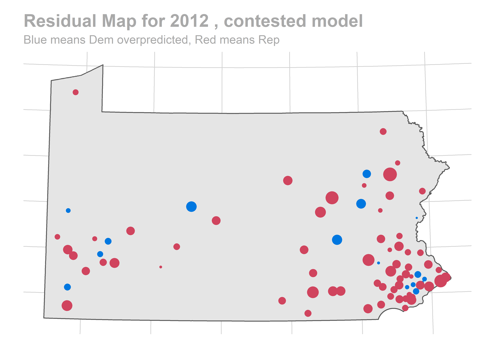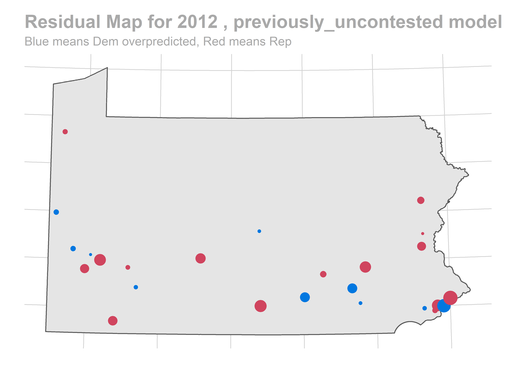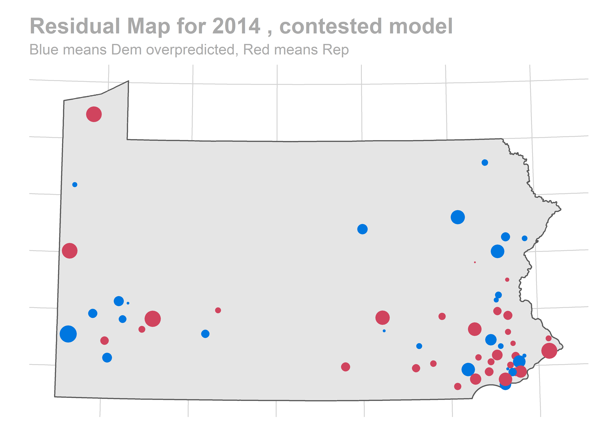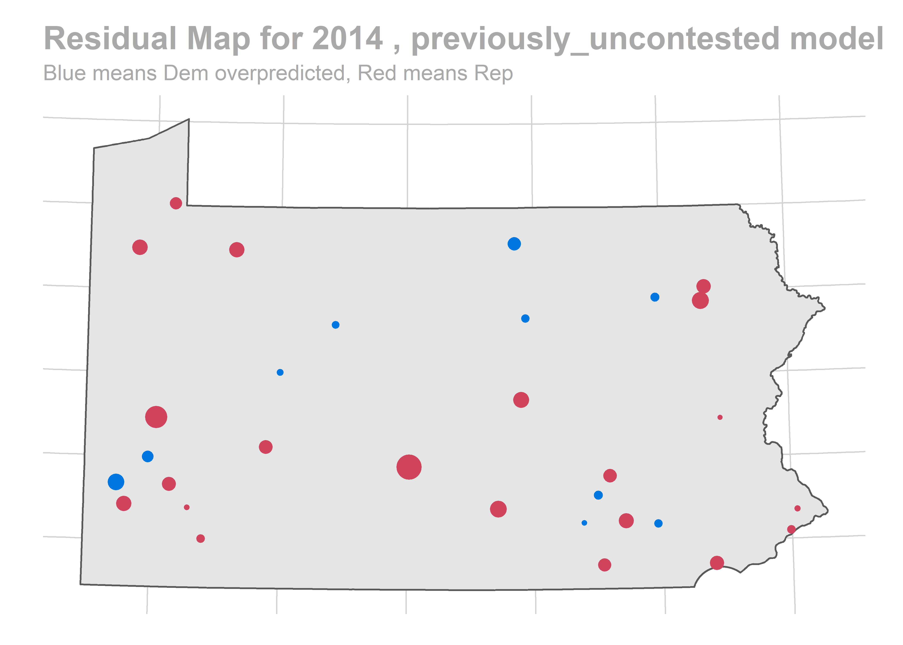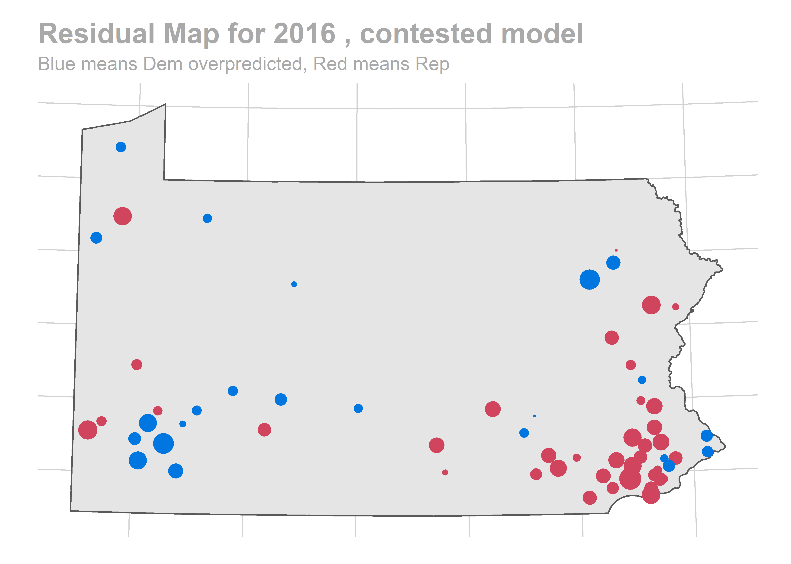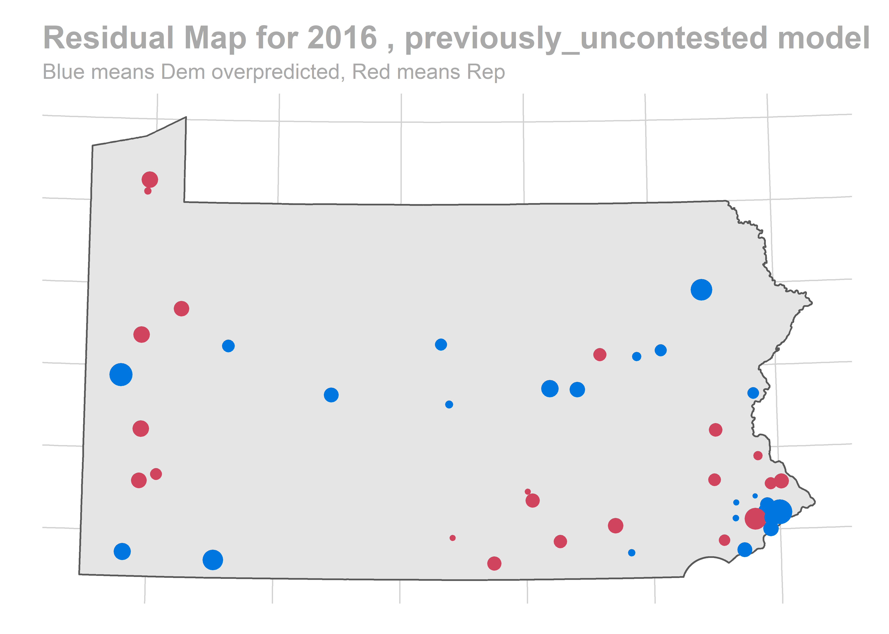

The biggest pattern is that we miss a bunch of races in a year all in the same way. It looks like maybe we also miss Philadelphia all in the same direction when we do (though notably, that's not true in e.g. 2012).

Done with the due diligence. Let's predict!

## Predicting 2018

We'll predict the 2018 election. We've already prepped the 2018 equivalent of `df` in [Prepping the Data for Analysis](03_rectangular_data.html).


```r
load("outputs/df_2018.rda")

df_2018 <- df_2018 %>% add_cols()
df_2018 <- add_condition(df_2018, conditions)
vote_df <- bind_rows(vote_df, df_2018)

pred_2018 <- bootstrap(
  vote_df,
  holdout_year=2018,
  conditions=conditions
)
```

```
## [1] 100
## [1] 200
## [1] 300
## [1] 400
## [1] 500
```

```r
gg_race_pred(pred_2018)
```

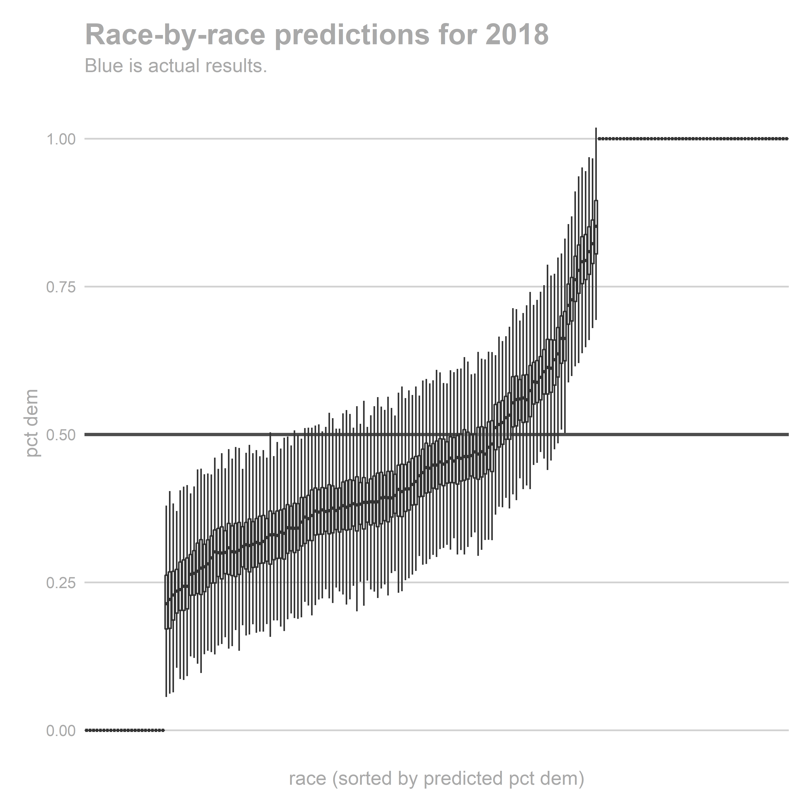

```r
gg_pred_hist(pred_2018, true_line = FALSE)
```

```
## [1] "bootstrapped predictions"
## [1] "Total NA: 0"
## [1] 88.434
##   2.5%  20.0%  80.0%  97.5% 
## 76.868 83.868 93.068 97.868
```

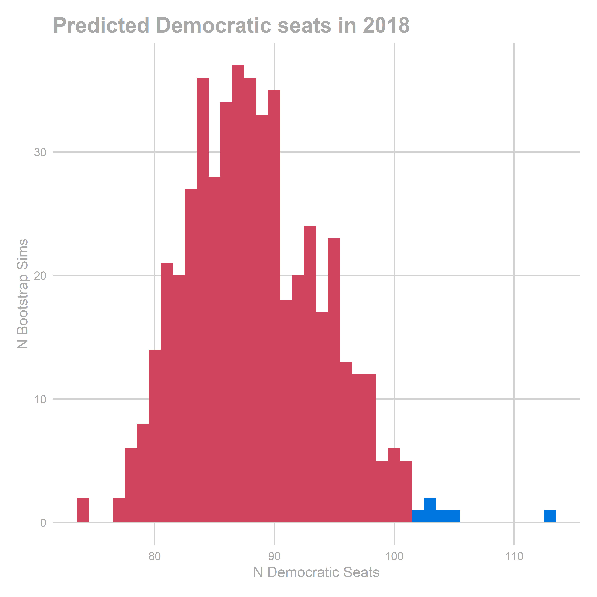

We predict Republicans to win the house 215-88, with a 95% CI on Dem seats of [76 - 97]. Republicans win the majority in 98.8% of bootstraps. 

## Fast forward to today

Ok, we're not actually in October 2018. We know who actually won. How did these predictions do?


```r
results_2018 <- read.csv(
  "data/UnOfficial_11232018092637AM.csv"
) %>%
  mutate(
    vote_total = asnum(gsub("\\,","",Votes)),
    sth = sprintf("%03d", asnum(gsub("^([0-9]+)[a-z].*", "\\1", District.Name))),
    party = ifelse(
      Party.Name == "Democratic", "DEM", 
      ifelse(Party.Name == "Republican", "REP", NA)
    )
  ) %>%
  mutate(
    party = replace(
      party, 
      Candidate.Name %in% c(
        "BERNSTINE, AARON JOSEPH ",  "SANKEY, THOMAS R III", "GABLER, MATTHEW M "), 
      "REP"
    ),
    party = replace(party, Candidate.Name == "LONGIETTI, MARK ALFRED ", "DEM")
  ) %>%
  filter(!is.na(party)) %>%
  group_by(sth, party) %>%
  summarise(votes = sum(vote_total)) %>%
  group_by(sth) %>%
  summarise(sth_pctdem = sum(votes * (party == "DEM")) / sum(votes))

vote_df <- left_join(vote_df, results_2018, by = "sth", suffix = c("",".2018")) %>%
  mutate(
    sth_pctdem = ifelse(
      substr(race,1,4)=="2018", 
      sth_pctdem.2018, 
      sth_pctdem
    )
  ) %>% select(-sth_pctdem.2018)
  
gg_pred_hist(pred_2018)
```

```
## [1] "bootstrapped predictions"
## [1] "Total NA: 0"
## [1] 88.434
##   2.5%  20.0%  80.0%  97.5% 
## 76.868 83.868 93.068 97.868 
## [1] "actual results"
## [1] 93
```


Democrats won 93 State House seats, right in the heart of our prediction.


```r
gg_race_pred(pred_2018)
```


These look ok, but we underpredicted Democrats in strong Republican districts. Democrats won a bunch of seats that we thought were going to be 60-40 Republican wins.

Remember when I said you would know it when we saw a bad residual percentile histogram?

```r
gg_resid(pred_2018)
```


We did well in the previously uncontested models, but systematically underpredicted the contested model. Such is the effect of year-level random effects.

That's it! I'm going to claim victory: the real result was right in the heart of our distribution.

See you in 2020!
